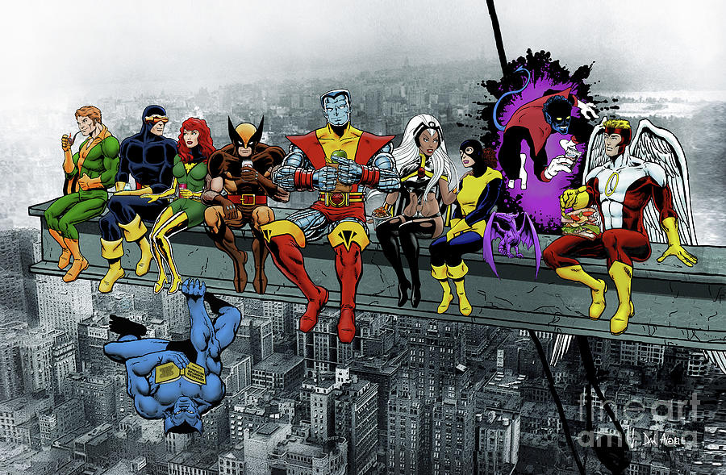

# This is a national broadcasted tutorial presented to you by 

    


   


* What is a sequel?
    * A sequel is a continuation or an expansion of a story. Over the years, we have seen great movies have sequels. Some do good or even great, and some others cannot live up to their predecessors. So, sequels are a very important part in the movie industry. In this project, we want to explore sequels in a different way. Do late sequels do better than early sequels? In our case, we are going to define late sequels as sequels that were release at least 7 years late than their predecessors, and early sequels as sequels that were release 7 before at most 6 years late than their predecessors. We are going to observe some of the best and popular movies and their sequels and separate them into two groups (late and early sequels). From there, we will make various analysis to find out which of the two groups do better according to their box office number. To add to our research, we will also look international movies and their sequels.


* Hypothesis: When looking at sequels, does the timeframe in between sequels affect the revenue/sales.
* Null: TimeFrame has no impact on whether sequels proform better or worse

# Top Grossing


```python
import pandas as pd
import numpy as np
import requests
from bs4 import BeautifulSoup
import re
import seaborn as sns
import matplotlib.pyplot as plt
import sklearn.linear_model as lm
import sklearn.datasets as ds
```


```python
%pip install lxml
# Data Mining/Collection
s1 = "https://www.thewrap.com/32-movie-sequels-took-forever-long-delay-blade-runner/"
s2 = "https://en.wikipedia.org/wiki/List_of_film_sequels_by_box-office_performance"
s3 = "https://www.the-numbers.com/movies/franchise/Fast-and-the-Furious#tab=summary"
s4 = "https://www.the-numbers.com/movies/franchise/Rocky#tab=summary"

wiki = pd.read_html(s2,header=0)

slight_improvement = wiki[0]
much_improvement = wiki[1]
top_grossing = wiki[2]

big_wiki = much_improvement.append(slight_improvement,ignore_index=True)
big_wiki.drop(columns='Improvement (%)',inplace=True)
big_wiki.drop(index=13, inplace=True)


def improvement (original,sequel):
    pct = (sequel - original)/original * 100
    return round(pct,3)

x_list = []
y_list = []

# This loop pulls the number strings and converts them to ints by removing the 
# commas from the strings first
for (idx,row) in big_wiki.iterrows():
    s = row['Gross']
    nums = re.findall("[0-9]+",s)
    nums.pop()
    num = ""
    for i in nums:
        num+=i
    sequel = int(num)
       
    s = row["Predecessor's gross"]
    nums = re.findall("[0-9]+",s)
    nums.pop()
    num = ""
    for i in nums:
        num+=i
    
    original = int(num)
    increase = improvement(original,sequel)
    wait = int(row["Year"]) - int(row["Year (predecessor)"])
    
    #putting 
    x_list.insert(idx, wait)
    y_list.insert(idx, increase)

    
# Generating tables we can use for later
plot1 = pd.DataFrame()
plot1["Title"] = big_wiki["Title"]
plot1["Gap (in Years)"] = x_list
plot1["Profit Increase(%)"] = y_list
plot1.sort_values('Gap (in Years)')
plot1.plot(x='Gap (in Years)',y='Profit Increase(%)', kind="scatter",figsize=(12,6),s=100,
                   logy=False, title='Success vs Length Between Films ', color='blue',)

```

    Collecting lxml
      Downloading lxml-4.6.3-cp38-cp38-manylinux2014_x86_64.whl (6.8 MB)
         |████████████████████████████████| 6.8 MB 7.3 MB/s eta 0:00:01
    [?25hInstalling collected packages: lxml
    Successfully installed lxml-4.6.3
    Note: you may need to restart the kernel to use updated packages.


    <AxesSubplot:title={'center':'Success vs Length Between Films '}, xlabel='Gap (in Years)', ylabel='Profit Increase(%)'>


    

    


# Linear Regression Model


```python
regr = lm.LinearRegression()
y = np.array(y_list)
y = y.reshape(-1,1)
x = np.array(x_list)
x = x.reshape(-1,1)
lr = regr.fit(x,y)
intercept = lr.intercept_
slope = lr.coef_
y = (intercept + slope*x).reshape(24,)
fig = plt.figure(figsize=(12,6))
plt.plot(x,y,'green', linewidth=5,
         data = plot1.plot(x='Gap (in Years)',y='Profit Increase(%)', kind="scatter",figsize=(12,6),
                           s=200, title='Success vs Length Between Films', color='blue',fontsize=20))
plt.xlabel('Gap (in Years)')
plt.ylabel('Profit Increase(%)')
plt.ylim(0,1500)
plt.xlim(1,35)
plt.grid()
plt.show()

```


    <Figure size 864x432 with 0 Axes>


    

    


* The green line is the Linear Regression and the scatterplot shows the sequels with the x axis showing the gap in between the first and latest sequel. The y-axis shows the profit margin increase of the sequels.
* Since the LR is a positive slope, the LR suggests that the longer you wait the more likely that the movies are going to improve even though our intuition would tell us otherwise.


* # Data Mining/Collection

* Getting the data from "https://www.thewrap.com/32-movie-sequels-took-forever-long-delay-blade-runner/" and putting the data in a table to manipulate


```python
site = requests.get(s1)
string = site.text

movies_raw = string.split("<strong>")#viewing the html string, this gives us a good enough 
# start to separate the items.
movies_raw.pop(0) #removes the prologue
movies_raw.pop() #removes the extra text at the end (including Bill&Ted info))
cols = ['Title','year','Predecessor','Pred. year']
data = [['Bill & Ted Face the Music'],['2020'],["\"Bill & Ted's Bogus Journey\""],['1991']]
    
# Retrieving the sequel title and year
for i in range(len(movies_raw)):
    title=re.search("(\"[a-zA-Z0-9\s:]+\")", movies_raw[i]).group(0)
    year=re.search("[12][0-9]{3}",movies_raw[i]).group(0)
    data[0].append(title)
    data[1].append(year)

    
# Sometimes Webscrapping can be uncooperative so the easiest thing to do is hardcode it. For a list of 
# less than 40 items it isn't too time-consuming.
Pred = [('Psycho', '1960'),('The Hustler', '1961'),('Texas Chainsaw Massacre','1974'),
        ('Chinatown', '1974'),('The Last Picture Show','1971'),('The Godfather Part II','1974'),
        ('The Odd Couple','1968'),('Blues Brothers','1980'),('Crocodile Dundee II','1988'),
        ('Clerks','1992'),('Rocky V','1990'),('Basic Instinct','1992'),('Die Hard with a Vengeance','1995'),
        ('Tron','1982'),('Wall Street','1987'),('The Best Man','1999'),('Dumb and Dumber','1994'),
        ('Jurrasic Park III','2001'),('Mad Max Beyond ThunderDome','1985'),('Independence Day','1996'),
        ('GhostBusters','1989'), ('My Big Fat Greek Wedding','2002'),('Zoolander','2001'),
        ('Bridget Jones: The Edge of Reason','2004'),('Finding Nemo','2003'),('BarberShop: Back in Business','2004'),
        ('Trainspotting','1996'), ('BladeRunner 2049','1982'),('XXX: State of the Union', '2005'),
        ('Super Trooper', '2001'),('Incredibles','2004'),('**Unbreakable','2000'),
        ('Rambo III','1999'),('Bad Boys II', '2003')
       ]

for (title,year) in Pred:
    data[2].append(f"\"{title}\"")
    data[3].append(year)    

# Builing the table using the site data
table1 = pd.DataFrame(columns=cols)
table1['Title']=data[0]
table1['year']=data[1]
table1['Predecessor']=data[2]
table1['Pred. year']=data[3]

diff = []
for (idx,row) in table1.iterrows():
    diff.append(int(row['year']) - int(row['Pred. year']))
    
table1["Gap (in Years)"] = diff
table1#.drop(columns="Predecessor year")
```


<div>
<style scoped>
    .dataframe tbody tr th:only-of-type {
        vertical-align: middle;
    }

    .dataframe tbody tr th {
        vertical-align: top;
    }

    .dataframe thead th {
        text-align: right;
    }
</style>
<table border="1" class="dataframe">
  <thead>
    <tr style="text-align: right;">
      <th></th>
      <th>Title</th>
      <th>year</th>
      <th>Predecessor</th>
      <th>Pred. year</th>
      <th>Gap (in Years)</th>
    </tr>
  </thead>
  <tbody>
    <tr>
      <th>0</th>
      <td>Bill &amp; Ted Face the Music</td>
      <td>2020</td>
      <td>"Bill &amp; Ted's Bogus Journey"</td>
      <td>1991</td>
      <td>29</td>
    </tr>
    <tr>
      <th>1</th>
      <td>"Psycho II"</td>
      <td>1983</td>
      <td>"Psycho"</td>
      <td>1960</td>
      <td>23</td>
    </tr>
    <tr>
      <th>2</th>
      <td>"The Color of Money"</td>
      <td>1986</td>
      <td>"The Hustler"</td>
      <td>1961</td>
      <td>25</td>
    </tr>
    <tr>
      <th>3</th>
      <td>"The Texas Chainsaw Massacre 2"</td>
      <td>1986</td>
      <td>"Texas Chainsaw Massacre"</td>
      <td>1974</td>
      <td>12</td>
    </tr>
    <tr>
      <th>4</th>
      <td>"The Two Jakes"</td>
      <td>1990</td>
      <td>"Chinatown"</td>
      <td>1974</td>
      <td>16</td>
    </tr>
    <tr>
      <th>5</th>
      <td>"Texasville"</td>
      <td>1990</td>
      <td>"The Last Picture Show"</td>
      <td>1971</td>
      <td>19</td>
    </tr>
    <tr>
      <th>6</th>
      <td>"The Godfather Part III"</td>
      <td>1990</td>
      <td>"The Godfather Part II"</td>
      <td>1974</td>
      <td>16</td>
    </tr>
    <tr>
      <th>7</th>
      <td>"The Odd Couple II"</td>
      <td>1998</td>
      <td>"The Odd Couple"</td>
      <td>1968</td>
      <td>30</td>
    </tr>
    <tr>
      <th>8</th>
      <td>"Blues Brothers 2000"</td>
      <td>2000</td>
      <td>"Blues Brothers"</td>
      <td>1980</td>
      <td>20</td>
    </tr>
    <tr>
      <th>9</th>
      <td>"Crocodile Dundee in Los Angeles"</td>
      <td>2001</td>
      <td>"Crocodile Dundee II"</td>
      <td>1988</td>
      <td>13</td>
    </tr>
    <tr>
      <th>10</th>
      <td>"Clerks 2"</td>
      <td>2004</td>
      <td>"Clerks"</td>
      <td>1992</td>
      <td>12</td>
    </tr>
    <tr>
      <th>11</th>
      <td>"Rocky Balboa"</td>
      <td>2006</td>
      <td>"Rocky V"</td>
      <td>1990</td>
      <td>16</td>
    </tr>
    <tr>
      <th>12</th>
      <td>"Basic Instinct 2"</td>
      <td>2006</td>
      <td>"Basic Instinct"</td>
      <td>1992</td>
      <td>14</td>
    </tr>
    <tr>
      <th>13</th>
      <td>"Live Free or Die Hard"</td>
      <td>2007</td>
      <td>"Die Hard with a Vengeance"</td>
      <td>1995</td>
      <td>12</td>
    </tr>
    <tr>
      <th>14</th>
      <td>"Tron: Legacy"</td>
      <td>2010</td>
      <td>"Tron"</td>
      <td>1982</td>
      <td>28</td>
    </tr>
    <tr>
      <th>15</th>
      <td>"Wall Street: Money Never Sleeps"</td>
      <td>2010</td>
      <td>"Wall Street"</td>
      <td>1987</td>
      <td>23</td>
    </tr>
    <tr>
      <th>16</th>
      <td>"The Best Man Holiday"</td>
      <td>2013</td>
      <td>"The Best Man"</td>
      <td>1999</td>
      <td>14</td>
    </tr>
    <tr>
      <th>17</th>
      <td>"Dumb and Dumber To"</td>
      <td>2014</td>
      <td>"Dumb and Dumber"</td>
      <td>1994</td>
      <td>20</td>
    </tr>
    <tr>
      <th>18</th>
      <td>"Jurassic World"</td>
      <td>2015</td>
      <td>"Jurrasic Park III"</td>
      <td>2001</td>
      <td>14</td>
    </tr>
    <tr>
      <th>19</th>
      <td>"Mad Max: Fury Road"</td>
      <td>2015</td>
      <td>"Mad Max Beyond ThunderDome"</td>
      <td>1985</td>
      <td>30</td>
    </tr>
    <tr>
      <th>20</th>
      <td>"Independence Day: Resurgence"</td>
      <td>2016</td>
      <td>"Independence Day"</td>
      <td>1996</td>
      <td>20</td>
    </tr>
    <tr>
      <th>21</th>
      <td>"Ghostbusters"</td>
      <td>2016</td>
      <td>"GhostBusters"</td>
      <td>1989</td>
      <td>27</td>
    </tr>
    <tr>
      <th>22</th>
      <td>"My Big Fat Greek Wedding 2"</td>
      <td>2016</td>
      <td>"My Big Fat Greek Wedding"</td>
      <td>2002</td>
      <td>14</td>
    </tr>
    <tr>
      <th>23</th>
      <td>"Zoolander 2"</td>
      <td>2016</td>
      <td>"Zoolander"</td>
      <td>2001</td>
      <td>15</td>
    </tr>
    <tr>
      <th>24</th>
      <td>"Finding Dory pixar"</td>
      <td>2016</td>
      <td>"Bridget Jones: The Edge of Reason"</td>
      <td>2004</td>
      <td>12</td>
    </tr>
    <tr>
      <th>25</th>
      <td>"Finding Dory"</td>
      <td>2016</td>
      <td>"Finding Nemo"</td>
      <td>2003</td>
      <td>13</td>
    </tr>
    <tr>
      <th>26</th>
      <td>"Barbershop: The Next Cut"</td>
      <td>2016</td>
      <td>"BarberShop: Back in Business"</td>
      <td>2004</td>
      <td>12</td>
    </tr>
    <tr>
      <th>27</th>
      <td>"T2 Trainspotting"</td>
      <td>2017</td>
      <td>"Trainspotting"</td>
      <td>1996</td>
      <td>21</td>
    </tr>
    <tr>
      <th>28</th>
      <td>"Blade Runner 2049"</td>
      <td>2049</td>
      <td>"BladeRunner 2049"</td>
      <td>1982</td>
      <td>67</td>
    </tr>
    <tr>
      <th>29</th>
      <td>"xXx: Return of Xander Cage"</td>
      <td>2017</td>
      <td>"XXX: State of the Union"</td>
      <td>2005</td>
      <td>12</td>
    </tr>
    <tr>
      <th>30</th>
      <td>"Super Troopers 2"</td>
      <td>2018</td>
      <td>"Super Trooper"</td>
      <td>2001</td>
      <td>17</td>
    </tr>
    <tr>
      <th>31</th>
      <td>"Incredibles 2"</td>
      <td>2018</td>
      <td>"Incredibles"</td>
      <td>2004</td>
      <td>14</td>
    </tr>
    <tr>
      <th>32</th>
      <td>"Glass"</td>
      <td>2019</td>
      <td>"**Unbreakable"</td>
      <td>2000</td>
      <td>19</td>
    </tr>
    <tr>
      <th>33</th>
      <td>"Rambo: Last Blood"</td>
      <td>2019</td>
      <td>"Rambo III"</td>
      <td>1999</td>
      <td>20</td>
    </tr>
    <tr>
      <th>34</th>
      <td>"Bad Boys For Life"</td>
      <td>2020</td>
      <td>"Bad Boys II"</td>
      <td>2003</td>
      <td>17</td>
    </tr>
  </tbody>
</table>
</div>


# WorldWide BoxOffice Sequels

* for this section of the code... we will be scraping the data from the_numbers.com and manipulating the recived data so that we can put it in a pandas table and perform some calculations.


```python
r = requests.get('https://www.the-numbers.com/box-office-records/worldwide/all-movies/cumulative/sequel')
soup = BeautifulSoup(r.content)
col = soup.find('table')
the = col.tbody.text
split = the.split("\n\n")

array = []
for i in range(len(split)):
    if split[i] != '':
        array.append(split[i].split("\n"))
        
for i in range(len(array)):
    if array[i][0] == '':
        array[i].remove('')
# putting on the table


table = pd.DataFrame(data = array, columns = ["Rank","Released","Movie","Worldwide Box Office","Domestic Box Office","International Box Office"])
n = table.sort_values(by = 'Movie')
# we removed data from the top 100 that did not have a sequel
updated_table = n.drop(index = [46,98,95,71,62,85,27,5,47,91,10,61,81,92,80,83,68,96,17,44,74,11,97,69,66,52,75])
updated_table.Movie[88] = 'Fast and Furious 5'
updated_table.Movie[4] = 'Fast and Furious 7'
updated_table
```


<div>
<style scoped>
    .dataframe tbody tr th:only-of-type {
        vertical-align: middle;
    }

    .dataframe tbody tr th {
        vertical-align: top;
    }

    .dataframe thead th {
        text-align: right;
    }
</style>
<table border="1" class="dataframe">
  <thead>
    <tr style="text-align: right;">
      <th></th>
      <th>Rank</th>
      <th>Released</th>
      <th>Movie</th>
      <th>Worldwide Box Office</th>
      <th>Domestic Box Office</th>
      <th>International Box Office</th>
    </tr>
  </thead>
  <tbody>
    <tr>
      <th>89</th>
      <td>89</td>
      <td>2018</td>
      <td>Ant-Man and the Wasp</td>
      <td>$623,144,660</td>
      <td>$216,648,740</td>
      <td>$406,495,920</td>
    </tr>
    <tr>
      <th>6</th>
      <td>7</td>
      <td>2015</td>
      <td>Avengers: Age of Ultron</td>
      <td>$1,395,316,979</td>
      <td>$459,005,868</td>
      <td>$936,311,111</td>
    </tr>
    <tr>
      <th>0</th>
      <td>1</td>
      <td>2019</td>
      <td>Avengers: Endgame</td>
      <td>$2,797,800,564</td>
      <td>$858,373,000</td>
      <td>$1,939,427,564</td>
    </tr>
    <tr>
      <th>2</th>
      <td>3</td>
      <td>2018</td>
      <td>Avengers: Infinity War</td>
      <td>$2,044,540,523</td>
      <td>$678,815,482</td>
      <td>$1,365,725,041</td>
    </tr>
    <tr>
      <th>13</th>
      <td>14</td>
      <td>2016</td>
      <td>Captain America: Civil War</td>
      <td>$1,151,918,521</td>
      <td>$408,084,349</td>
      <td>$743,834,172</td>
    </tr>
    <tr>
      <th>...</th>
      <td>...</td>
      <td>...</td>
      <td>...</td>
      <td>...</td>
      <td>...</td>
      <td>...</td>
    </tr>
    <tr>
      <th>20</th>
      <td>21</td>
      <td>2019</td>
      <td>Toy Story 4</td>
      <td>$1,073,080,329</td>
      <td>$434,038,008</td>
      <td>$639,042,321</td>
    </tr>
    <tr>
      <th>18</th>
      <td>19</td>
      <td>2014</td>
      <td>Transformers: Age of Extinction</td>
      <td>$1,104,054,072</td>
      <td>$245,439,076</td>
      <td>$858,614,996</td>
    </tr>
    <tr>
      <th>15</th>
      <td>16</td>
      <td>2011</td>
      <td>Transformers: Dark of the Moon</td>
      <td>$1,123,794,079</td>
      <td>$352,390,543</td>
      <td>$771,403,536</td>
    </tr>
    <tr>
      <th>51</th>
      <td>52</td>
      <td>2009</td>
      <td>Transformers: Revenge of the Fallen</td>
      <td>$836,519,699</td>
      <td>$402,111,870</td>
      <td>$434,407,829</td>
    </tr>
    <tr>
      <th>93</th>
      <td>93</td>
      <td>2017</td>
      <td>Transformers: The Last Knight</td>
      <td>$602,893,340</td>
      <td>$130,168,683</td>
      <td>$472,724,657</td>
    </tr>
  </tbody>
</table>
<p>74 rows × 6 columns</p>
</div>


* So now that we have out data, we need to separate our data from our sequels and our non sequels, which we have done with the code provided above. In this table we can see movies that dont have sequels or are not present in the table, so we removed them.
* On our next step we will be calcualting difference in the year, difference between the Box Office amount, and also calculating the percent difference between the original movie and the latest sequel.
* Then put these new calculations into a new datatable.


```python
# all the sequels in this table
Sequels = ['Avengers','Captain America','Despicable Me','Fast and Furious','Harry Potter','Ice Age','Iron Man','Jumanji','Jurassic World','Madagascar','Mission: impossible','Shrek','Spider-Man','Star Wars','The Amazing Spider-man','Dark Knight','The Hobbit','The Hunger Games','The Lord of the Rings','The Twilight Saga','Thor','Toy Story','Transformers']

#this is calculating the differenc between year and in boxoffice amount of the different sequels
year_diff = []
amount_diff = []
each_movie_percent = []
num_of_sequels = []

# this is running through the sequels and calulating year, amount, and precent
for i in Sequels:

    each_movie_table = updated_table[updated_table['Movie'].str.contains(i, regex=False, case=False, na=False)]
    num_of_sequels.append(len(each_movie_table.Movie))
    each_movie_table = each_movie_table.sort_values(by = "Released")
    
    each_movie = each_movie_table.Released
    each_movie_money =  each_movie_table['Worldwide Box Office']
    #removing the $ and the , so that i can change into an int
    each_movie_money = each_movie_money.str.replace(r'$', '')
    each_movie_money = each_movie_money.str.replace(r',','')
    
    size = len(each_movie_table)
    #print(int(np.array(each_movie)[size-1]))
    #print(int(np.array(each_movie)[size-size]))
    
    year_diff.append(abs(int(np.array(each_movie)[size-1]) - int(np.array(each_movie)[size-size])))
    amount_diff.append(abs(int(np.array(each_movie_money)[size-1]) - int(np.array(each_movie_money)[size-size])))
    each_movie_percent.append(round((abs(int(np.array(each_movie_money)[size-1]) - int(np.array(each_movie_money)[size-size]))/int(np.array(each_movie_money)[size-1])),3)*100)

    
#putting the new values into a table
Seq_diff = pd.DataFrame(data = [], columns = ["Movie","# of Sequels","Next/last Sequel..Year Diff","Diff in sequence amount","Perc"])
Seq_diff["Movie"] = Sequels
Seq_diff["Next/last Sequel..Year Diff"] = year_diff
Seq_diff["Diff in sequence amount"] = amount_diff
Seq_diff["Perc"] = each_movie_percent
Seq_diff['# of Sequels'] = num_of_sequels
Seq_diff

```

    <ipython-input-7-ebe497375621>:20: FutureWarning: The default value of regex will change from True to False in a future version. In addition, single character regular expressions will*not* be treated as literal strings when regex=True.
      each_movie_money = each_movie_money.str.replace(r'$', '')


<div>
<style scoped>
    .dataframe tbody tr th:only-of-type {
        vertical-align: middle;
    }

    .dataframe tbody tr th {
        vertical-align: top;
    }

    .dataframe thead th {
        text-align: right;
    }
</style>
<table border="1" class="dataframe">
  <thead>
    <tr style="text-align: right;">
      <th></th>
      <th>Movie</th>
      <th># of Sequels</th>
      <th>Next/last Sequel..Year Diff</th>
      <th>Diff in sequence amount</th>
      <th>Perc</th>
    </tr>
  </thead>
  <tbody>
    <tr>
      <th>0</th>
      <td>Avengers</td>
      <td>3</td>
      <td>4</td>
      <td>1402483585</td>
      <td>50.1</td>
    </tr>
    <tr>
      <th>1</th>
      <td>Captain America</td>
      <td>2</td>
      <td>2</td>
      <td>437516632</td>
      <td>38.0</td>
    </tr>
    <tr>
      <th>2</th>
      <td>Despicable Me</td>
      <td>2</td>
      <td>4</td>
      <td>57380059</td>
      <td>5.6</td>
    </tr>
    <tr>
      <th>3</th>
      <td>Fast and Furious</td>
      <td>3</td>
      <td>4</td>
      <td>887016255</td>
      <td>58.5</td>
    </tr>
    <tr>
      <th>4</th>
      <td>Harry Potter</td>
      <td>7</td>
      <td>9</td>
      <td>457883739</td>
      <td>34.3</td>
    </tr>
    <tr>
      <th>5</th>
      <td>Ice Age</td>
      <td>3</td>
      <td>6</td>
      <td>227865855</td>
      <td>25.9</td>
    </tr>
    <tr>
      <th>6</th>
      <td>Iron Man</td>
      <td>2</td>
      <td>3</td>
      <td>594235883</td>
      <td>48.9</td>
    </tr>
    <tr>
      <th>7</th>
      <td>Jumanji</td>
      <td>2</td>
      <td>2</td>
      <td>161411570</td>
      <td>20.2</td>
    </tr>
    <tr>
      <th>8</th>
      <td>Jurassic World</td>
      <td>2</td>
      <td>3</td>
      <td>361645962</td>
      <td>27.6</td>
    </tr>
    <tr>
      <th>9</th>
      <td>Madagascar</td>
      <td>2</td>
      <td>4</td>
      <td>147240497</td>
      <td>19.7</td>
    </tr>
    <tr>
      <th>10</th>
      <td>Mission: impossible</td>
      <td>4</td>
      <td>18</td>
      <td>237588213</td>
      <td>30.2</td>
    </tr>
    <tr>
      <th>11</th>
      <td>Shrek</td>
      <td>3</td>
      <td>6</td>
      <td>179009305</td>
      <td>23.7</td>
    </tr>
    <tr>
      <th>12</th>
      <td>Spider-Man</td>
      <td>5</td>
      <td>15</td>
      <td>336522088</td>
      <td>29.7</td>
    </tr>
    <tr>
      <th>13</th>
      <td>Star Wars</td>
      <td>7</td>
      <td>39</td>
      <td>523942980</td>
      <td>48.8</td>
    </tr>
    <tr>
      <th>14</th>
      <td>The Amazing Spider-man</td>
      <td>2</td>
      <td>2</td>
      <td>48893931</td>
      <td>6.9</td>
    </tr>
    <tr>
      <th>15</th>
      <td>Dark Knight</td>
      <td>2</td>
      <td>4</td>
      <td>83181826</td>
      <td>7.7</td>
    </tr>
    <tr>
      <th>16</th>
      <td>The Hobbit</td>
      <td>3</td>
      <td>2</td>
      <td>73674663</td>
      <td>7.8</td>
    </tr>
    <tr>
      <th>17</th>
      <td>The Hunger Games</td>
      <td>3</td>
      <td>2</td>
      <td>215881260</td>
      <td>33.3</td>
    </tr>
    <tr>
      <th>18</th>
      <td>The Lord of the Rings</td>
      <td>2</td>
      <td>1</td>
      <td>201075282</td>
      <td>17.9</td>
    </tr>
    <tr>
      <th>19</th>
      <td>The Twilight Saga</td>
      <td>4</td>
      <td>3</td>
      <td>142167010</td>
      <td>17.1</td>
    </tr>
    <tr>
      <th>20</th>
      <td>Thor</td>
      <td>2</td>
      <td>4</td>
      <td>205880262</td>
      <td>24.2</td>
    </tr>
    <tr>
      <th>21</th>
      <td>Toy Story</td>
      <td>2</td>
      <td>9</td>
      <td>4200807</td>
      <td>0.4</td>
    </tr>
    <tr>
      <th>22</th>
      <td>Transformers</td>
      <td>4</td>
      <td>8</td>
      <td>233626359</td>
      <td>38.8</td>
    </tr>
  </tbody>
</table>
</div>


* splitting the data into early and late sequels.
* we are defining a "late" sequel as being a movie that takes over 7 years inbetweeen. a
* And a "early" sequel being within the first 7 years.
* when looking at the data table we can see that there are more early sequels when compared to the later sequels. One early hypothesis would be that keeping the release of a movie within the first 7 years has the perfect blend of anticipation without the hype for the movie dying.


```python
#separating the table by early sequence

early_sequels = Seq_diff[Seq_diff["Next/last Sequel..Year Diff"] <= 7 ]
early_sequels = early_sequels.sort_values(by = "Diff in sequence amount")
early_sequels
```


<div>
<style scoped>
    .dataframe tbody tr th:only-of-type {
        vertical-align: middle;
    }

    .dataframe tbody tr th {
        vertical-align: top;
    }

    .dataframe thead th {
        text-align: right;
    }
</style>
<table border="1" class="dataframe">
  <thead>
    <tr style="text-align: right;">
      <th></th>
      <th>Movie</th>
      <th># of Sequels</th>
      <th>Next/last Sequel..Year Diff</th>
      <th>Diff in sequence amount</th>
      <th>Perc</th>
    </tr>
  </thead>
  <tbody>
    <tr>
      <th>14</th>
      <td>The Amazing Spider-man</td>
      <td>2</td>
      <td>2</td>
      <td>48893931</td>
      <td>6.9</td>
    </tr>
    <tr>
      <th>2</th>
      <td>Despicable Me</td>
      <td>2</td>
      <td>4</td>
      <td>57380059</td>
      <td>5.6</td>
    </tr>
    <tr>
      <th>16</th>
      <td>The Hobbit</td>
      <td>3</td>
      <td>2</td>
      <td>73674663</td>
      <td>7.8</td>
    </tr>
    <tr>
      <th>15</th>
      <td>Dark Knight</td>
      <td>2</td>
      <td>4</td>
      <td>83181826</td>
      <td>7.7</td>
    </tr>
    <tr>
      <th>19</th>
      <td>The Twilight Saga</td>
      <td>4</td>
      <td>3</td>
      <td>142167010</td>
      <td>17.1</td>
    </tr>
    <tr>
      <th>9</th>
      <td>Madagascar</td>
      <td>2</td>
      <td>4</td>
      <td>147240497</td>
      <td>19.7</td>
    </tr>
    <tr>
      <th>7</th>
      <td>Jumanji</td>
      <td>2</td>
      <td>2</td>
      <td>161411570</td>
      <td>20.2</td>
    </tr>
    <tr>
      <th>11</th>
      <td>Shrek</td>
      <td>3</td>
      <td>6</td>
      <td>179009305</td>
      <td>23.7</td>
    </tr>
    <tr>
      <th>18</th>
      <td>The Lord of the Rings</td>
      <td>2</td>
      <td>1</td>
      <td>201075282</td>
      <td>17.9</td>
    </tr>
    <tr>
      <th>20</th>
      <td>Thor</td>
      <td>2</td>
      <td>4</td>
      <td>205880262</td>
      <td>24.2</td>
    </tr>
    <tr>
      <th>17</th>
      <td>The Hunger Games</td>
      <td>3</td>
      <td>2</td>
      <td>215881260</td>
      <td>33.3</td>
    </tr>
    <tr>
      <th>5</th>
      <td>Ice Age</td>
      <td>3</td>
      <td>6</td>
      <td>227865855</td>
      <td>25.9</td>
    </tr>
    <tr>
      <th>8</th>
      <td>Jurassic World</td>
      <td>2</td>
      <td>3</td>
      <td>361645962</td>
      <td>27.6</td>
    </tr>
    <tr>
      <th>1</th>
      <td>Captain America</td>
      <td>2</td>
      <td>2</td>
      <td>437516632</td>
      <td>38.0</td>
    </tr>
    <tr>
      <th>6</th>
      <td>Iron Man</td>
      <td>2</td>
      <td>3</td>
      <td>594235883</td>
      <td>48.9</td>
    </tr>
    <tr>
      <th>3</th>
      <td>Fast and Furious</td>
      <td>3</td>
      <td>4</td>
      <td>887016255</td>
      <td>58.5</td>
    </tr>
    <tr>
      <th>0</th>
      <td>Avengers</td>
      <td>3</td>
      <td>4</td>
      <td>1402483585</td>
      <td>50.1</td>
    </tr>
  </tbody>
</table>
</div>


*  when looking at the late sequels, we can see that they are all running over a decade. Now looking at our early hypothesis we are stating that since the total number of sequels greatly exceeded those of the later released sequels, we say that the early released sequels will preform better, but when looking at the data for the late sequels we see that even though late sequels have total less amount, each individual movie in the late sequels has a greater number of sequels and has a slightly larger gross income between the first movie and last movie.


```python
#Separating by late sequel
late_sequels = Seq_diff[Seq_diff["Next/last Sequel..Year Diff"] > 7 ]
late_sequels = late_sequels.sort_values(by = "Diff in sequence amount")
late_sequels
```


<div>
<style scoped>
    .dataframe tbody tr th:only-of-type {
        vertical-align: middle;
    }

    .dataframe tbody tr th {
        vertical-align: top;
    }

    .dataframe thead th {
        text-align: right;
    }
</style>
<table border="1" class="dataframe">
  <thead>
    <tr style="text-align: right;">
      <th></th>
      <th>Movie</th>
      <th># of Sequels</th>
      <th>Next/last Sequel..Year Diff</th>
      <th>Diff in sequence amount</th>
      <th>Perc</th>
    </tr>
  </thead>
  <tbody>
    <tr>
      <th>21</th>
      <td>Toy Story</td>
      <td>2</td>
      <td>9</td>
      <td>4200807</td>
      <td>0.4</td>
    </tr>
    <tr>
      <th>22</th>
      <td>Transformers</td>
      <td>4</td>
      <td>8</td>
      <td>233626359</td>
      <td>38.8</td>
    </tr>
    <tr>
      <th>10</th>
      <td>Mission: impossible</td>
      <td>4</td>
      <td>18</td>
      <td>237588213</td>
      <td>30.2</td>
    </tr>
    <tr>
      <th>12</th>
      <td>Spider-Man</td>
      <td>5</td>
      <td>15</td>
      <td>336522088</td>
      <td>29.7</td>
    </tr>
    <tr>
      <th>4</th>
      <td>Harry Potter</td>
      <td>7</td>
      <td>9</td>
      <td>457883739</td>
      <td>34.3</td>
    </tr>
    <tr>
      <th>13</th>
      <td>Star Wars</td>
      <td>7</td>
      <td>39</td>
      <td>523942980</td>
      <td>48.8</td>
    </tr>
  </tbody>
</table>
</div>


```python
c = sns.scatterplot(data=early_sequels, x="Next/last Sequel..Year Diff", y="Perc",hue = "Movie")

plt.title('Worldwide Early Sequels')
plt.legend(bbox_to_anchor=(1.05, 1), loc=2, borderaxespad=0.)

plt.show
```


    <function matplotlib.pyplot.show(close=None, block=None)>


    

    


```python
sns.scatterplot(data=late_sequels, x="Next/last Sequel..Year Diff", y="Perc",hue = "Movie")
plt.title('Worldwide Late Sequels')
plt.legend(bbox_to_anchor=(1.05, 1), loc=2, borderaxespad=0.)
plt.show
```


    <function matplotlib.pyplot.show(close=None, block=None)>


    

    


```python
ax = sns.scatterplot(data=Seq_diff, x="Next/last Sequel..Year Diff", y="Perc",hue = "Movie")
plt.title('Worldwide Sequels')
plt.legend(bbox_to_anchor=(1.05, 1), loc=2, borderaxespad=0.)
plt.show()
```


    

    


# Linear Regression for WorldWide Sequels
* This is a linear regression plot for the WorldWide Sequels shown above

* for the sake of the Linear Regression, removed the outlier (Starwars)


```python
Seq_diff.drop(index = 13,inplace = True)
ax = sns.scatterplot(data=Seq_diff, x="Next/last Sequel..Year Diff", y="Perc")
sns.regplot(data=Seq_diff, x="Next/last Sequel..Year Diff", y="Perc", ax=ax)
plt.title("LinearRegression for WorldWide Sequels")
```


    Text(0.5, 1.0, 'LinearRegression for WorldWide Sequels')


    

    


# Differences between Franchise and time period.
* looking to see if a Franchise's popularity and the time period plays a role in the success or failure of sequels.

* Will be picking 5 franchiese from current and 5 francises from past years.
    * Current = Marvel, X-Men, James Bond, Men In Black
    * Past    = King Kong, The Omen, psyco, Wizard of Oz

* For each of these franchises's we will be scraping the data from boxoffice mojo and others if need be.
* After we have imported all the data, some of the tables have missing data (for movies(sequels) that are yet to come, or they have not been updated int he database. So for thses cases we will be removing data that wll not be helping in our investigation.
* we will be using the opening boxoffice numbers to calculate the difference between the latest sequel and the original.
* we will also be calculating the percentage so that it will be easier to understand.

# Marvel


```python
r = requests.get('https://www.boxofficemojo.com/franchise/fr4148662021/?ref_=bo_frs_table_1')
soup = BeautifulSoup(r.content)
col = soup.find('table')
opening = col.find_all('td',class_ = 'a-text-right mojo-field-type-money')
lifetime = col.find_all('td',class_ = 'a-text-right mojo-field-type-money mojo-sort-column mojo-estimatable')
names = col.find_all('td',class_ = 'a-text-left mojo-field-type-release mojo-cell-wide')
dates = col.find_all('td',class_ = 'a-text-left mojo-field-type-date a-nowrap')

name = []
life = []
opn = []
date = []
for i in names:
    name.append(i.text)
for i in lifetime:
    life.append(i.text)
for i in opening:
    opn.append(i.text)
for i in dates:
    date.append(i.text)
    
table = pd.DataFrame(data = [], columns = ["name","Date","open","life"])
table["name"] = name
table["open"] = life
table["life"] = opn
table["Date"] = date
table = table.drop([36,26,28,35,30,32,27,34,29,31,37,33,25,24,23])
new_table = table.drop
table.Date = pd.to_datetime(table.Date)
table = table.sort_values(by = "Date")

b = table.open
b = b.str.replace(r'$','')
b = b.str.replace(r',','')
a = np.array(b) 
Diff_array = []
per_array = []
Diff_array.append(int(a[len(a)-1]) - int(a[0]))
num1 = int(a[len(a)-1])
num2 = int(a[0])
per_array.append(round(((num1 - num2)/num1) *100,3))
table
```

    <ipython-input-14-70efc41fd985>:33: FutureWarning: The default value of regex will change from True to False in a future version. In addition, single character regular expressions will*not* be treated as literal strings when regex=True.
      b = b.str.replace(r'$','')


<div>
<style scoped>
    .dataframe tbody tr th:only-of-type {
        vertical-align: middle;
    }

    .dataframe tbody tr th {
        vertical-align: top;
    }

    .dataframe thead th {
        text-align: right;
    }
</style>
<table border="1" class="dataframe">
  <thead>
    <tr style="text-align: right;">
      <th></th>
      <th>name</th>
      <th>Date</th>
      <th>open</th>
      <th>life</th>
    </tr>
  </thead>
  <tbody>
    <tr>
      <th>12</th>
      <td>Iron Man</td>
      <td>2008-05-02</td>
      <td>$318,604,126</td>
      <td>$98,618,668</td>
    </tr>
    <tr>
      <th>22</th>
      <td>The Incredible Hulk</td>
      <td>2008-06-13</td>
      <td>$134,806,913</td>
      <td>$55,414,050</td>
    </tr>
    <tr>
      <th>14</th>
      <td>Iron Man 2</td>
      <td>2010-05-07</td>
      <td>$312,433,331</td>
      <td>$128,122,480</td>
    </tr>
    <tr>
      <th>19</th>
      <td>Thor</td>
      <td>2011-05-06</td>
      <td>$181,030,624</td>
      <td>$65,723,338</td>
    </tr>
    <tr>
      <th>21</th>
      <td>Captain America: The First Avenger</td>
      <td>2011-07-22</td>
      <td>$176,654,505</td>
      <td>$65,058,524</td>
    </tr>
    <tr>
      <th>3</th>
      <td>The Avengers</td>
      <td>2012-05-04</td>
      <td>$623,357,910</td>
      <td>$207,438,708</td>
    </tr>
    <tr>
      <th>6</th>
      <td>Iron Man 3</td>
      <td>2013-05-03</td>
      <td>$409,013,994</td>
      <td>$174,144,585</td>
    </tr>
    <tr>
      <th>18</th>
      <td>Thor: The Dark World</td>
      <td>2013-11-08</td>
      <td>$206,362,140</td>
      <td>$85,737,841</td>
    </tr>
    <tr>
      <th>15</th>
      <td>Captain America: The Winter Soldier</td>
      <td>2014-04-04</td>
      <td>$259,766,572</td>
      <td>$95,023,721</td>
    </tr>
    <tr>
      <th>11</th>
      <td>Guardians of the Galaxy</td>
      <td>2014-08-01</td>
      <td>$333,176,600</td>
      <td>$94,320,883</td>
    </tr>
    <tr>
      <th>4</th>
      <td>Avengers: Age of Ultron</td>
      <td>2015-05-01</td>
      <td>$459,005,868</td>
      <td>$191,271,109</td>
    </tr>
    <tr>
      <th>20</th>
      <td>Ant-Man</td>
      <td>2015-07-17</td>
      <td>$180,202,163</td>
      <td>$57,225,526</td>
    </tr>
    <tr>
      <th>7</th>
      <td>Captain America: Civil War</td>
      <td>2016-05-06</td>
      <td>$408,084,349</td>
      <td>$179,139,142</td>
    </tr>
    <tr>
      <th>16</th>
      <td>Doctor Strange</td>
      <td>2016-11-04</td>
      <td>$232,641,920</td>
      <td>$85,058,311</td>
    </tr>
    <tr>
      <th>9</th>
      <td>Guardians of the Galaxy Vol. 2</td>
      <td>2017-05-05</td>
      <td>$389,813,101</td>
      <td>$146,510,104</td>
    </tr>
    <tr>
      <th>10</th>
      <td>Spider-Man: Homecoming</td>
      <td>2017-07-07</td>
      <td>$334,201,140</td>
      <td>$117,027,503</td>
    </tr>
    <tr>
      <th>13</th>
      <td>Thor: Ragnarok</td>
      <td>2017-11-03</td>
      <td>$315,058,289</td>
      <td>$122,744,989</td>
    </tr>
    <tr>
      <th>1</th>
      <td>Black Panther</td>
      <td>2018-02-16</td>
      <td>$700,059,566</td>
      <td>$202,003,951</td>
    </tr>
    <tr>
      <th>2</th>
      <td>Avengers: Infinity War</td>
      <td>2018-04-27</td>
      <td>$678,815,482</td>
      <td>$257,698,183</td>
    </tr>
    <tr>
      <th>17</th>
      <td>Ant-Man and the Wasp</td>
      <td>2018-07-06</td>
      <td>$216,648,740</td>
      <td>$75,812,205</td>
    </tr>
    <tr>
      <th>5</th>
      <td>Captain Marvel</td>
      <td>2019-03-08</td>
      <td>$426,829,839</td>
      <td>$153,433,423</td>
    </tr>
    <tr>
      <th>0</th>
      <td>Avengers: Endgame</td>
      <td>2019-04-26</td>
      <td>$858,373,000</td>
      <td>$357,115,007</td>
    </tr>
    <tr>
      <th>8</th>
      <td>Spider-Man: Far from Home</td>
      <td>2019-07-02</td>
      <td>$390,532,085</td>
      <td>$92,579,212</td>
    </tr>
  </tbody>
</table>
</div>


# Franchise X-Men




```python
r = requests.get('https://www.boxofficemojo.com/franchise/fr3712454405/?ref_=bo_frs_table_6')
soup = BeautifulSoup(r.content)
col = soup.find('table')
opening = col.find_all('td',class_ = 'a-text-right mojo-field-type-money')
lifetime = col.find_all('td',class_ = 'a-text-right mojo-field-type-money mojo-sort-column mojo-estimatable')
names = col.find_all('td',class_ = 'a-text-left mojo-field-type-release mojo-cell-wide')
dates = col.find_all('td',class_ = 'a-text-left mojo-field-type-date a-nowrap')

name = []
life = []
opn = []
date = []
for i in names:
    name.append(i.text)
for i in lifetime:
    life.append(i.text)
for i in opening:
    opn.append(i.text)
for i in dates:
    date.append(i.text)
    
table = pd.DataFrame(data = [], columns = ["name","Date","open","life"])
table["name"] = name
table["open"] = life
table["life"] = opn
table["Date"] = date
table.Date = pd.to_datetime(table.Date)
table = table.sort_values(by = "Date")
table
```


<div>
<style scoped>
    .dataframe tbody tr th:only-of-type {
        vertical-align: middle;
    }

    .dataframe tbody tr th {
        vertical-align: top;
    }

    .dataframe thead th {
        text-align: right;
    }
</style>
<table border="1" class="dataframe">
  <thead>
    <tr style="text-align: right;">
      <th></th>
      <th>name</th>
      <th>Date</th>
      <th>open</th>
      <th>life</th>
    </tr>
  </thead>
  <tbody>
    <tr>
      <th>7</th>
      <td>X-Men</td>
      <td>2000-07-14</td>
      <td>$157,299,718</td>
      <td>$54,471,475</td>
    </tr>
    <tr>
      <th>5</th>
      <td>X2: X-Men United</td>
      <td>2003-05-02</td>
      <td>$214,949,694</td>
      <td>$85,558,731</td>
    </tr>
    <tr>
      <th>2</th>
      <td>X-Men: The Last Stand</td>
      <td>2006-05-26</td>
      <td>$234,362,462</td>
      <td>$102,750,665</td>
    </tr>
    <tr>
      <th>6</th>
      <td>X-Men Origins: Wolverine</td>
      <td>2009-05-01</td>
      <td>$179,883,157</td>
      <td>$85,058,003</td>
    </tr>
    <tr>
      <th>9</th>
      <td>X-Men: First Class</td>
      <td>2011-06-03</td>
      <td>$146,408,305</td>
      <td>$55,101,604</td>
    </tr>
    <tr>
      <th>10</th>
      <td>The Wolverine</td>
      <td>2013-07-26</td>
      <td>$132,556,852</td>
      <td>$53,113,752</td>
    </tr>
    <tr>
      <th>3</th>
      <td>X-Men: Days of Future Past</td>
      <td>2014-05-23</td>
      <td>$233,921,534</td>
      <td>$90,823,660</td>
    </tr>
    <tr>
      <th>0</th>
      <td>Deadpool</td>
      <td>2016-02-12</td>
      <td>$363,070,709</td>
      <td>$132,434,639</td>
    </tr>
    <tr>
      <th>8</th>
      <td>X-Men: Apocalypse</td>
      <td>2016-05-27</td>
      <td>$155,442,489</td>
      <td>$65,769,562</td>
    </tr>
    <tr>
      <th>4</th>
      <td>Logan</td>
      <td>2017-03-03</td>
      <td>$226,277,068</td>
      <td>$88,411,916</td>
    </tr>
    <tr>
      <th>1</th>
      <td>Deadpool 2</td>
      <td>2018-05-18</td>
      <td>$318,491,426</td>
      <td>$125,507,153</td>
    </tr>
    <tr>
      <th>13</th>
      <td>Once Upon a Deadpool2018 Re-release</td>
      <td>2018-12-12</td>
      <td>$6,100,309</td>
      <td>$2,683,200</td>
    </tr>
    <tr>
      <th>11</th>
      <td>X-Men: Dark Phoenix</td>
      <td>2019-06-07</td>
      <td>$65,845,974</td>
      <td>$32,828,348</td>
    </tr>
    <tr>
      <th>12</th>
      <td>The New Mutants</td>
      <td>2020-08-28</td>
      <td>$23,852,659</td>
      <td>$7,037,017</td>
    </tr>
  </tbody>
</table>
</div>


```python
b = table.open
b = b.str.replace(r'$','')
b = b.str.replace(r',','')
a = np.array(b) 
Diff_array.append(abs(int(a[len(a)-1]) - int(a[0])))
num1 = int(a[len(a)-1])
num2 = int(a[0])
per_array.append(round(((num2 - num1)/num2) *100,3))
```

    <ipython-input-16-0e4d99d78ff0>:2: FutureWarning: The default value of regex will change from True to False in a future version. In addition, single character regular expressions will*not* be treated as literal strings when regex=True.
      b = b.str.replace(r'$','')


# Franchise: James Bond


```python
r = requests.get('https://www.boxofficemojo.com/franchise/fr2605158149/?ref_=bo_frs_table_3')
soup = BeautifulSoup(r.content)
col = soup.find('table')
opening = col.find_all('td',class_ = 'a-text-right mojo-field-type-money')
lifetime = col.find_all('td',class_ = 'a-text-right mojo-field-type-money mojo-sort-column mojo-estimatable')
names = col.find_all('td',class_ = 'a-text-left mojo-field-type-release mojo-cell-wide')
dates = col.find_all('td',class_ = 'a-text-left mojo-field-type-date a-nowrap')

name = []
life = []
opn = []
date = []
for i in names:
    name.append(i.text)
for i in lifetime:
    life.append(i.text)
for i in opening:
    opn.append(i.text)
for i in dates:
    date.append(i.text)
    
table = pd.DataFrame(data = [], columns = ["name","Date","open","life"])
table["name"] = name
table["open"] = life
table["life"] = opn
table["Date"] = date

table.Date = pd.to_datetime(table.Date)
table = table.sort_values(by = "Date")
table = table.drop([24,21,14,10,18,22,17,19,23,16,25])
table
```


<div>
<style scoped>
    .dataframe tbody tr th:only-of-type {
        vertical-align: middle;
    }

    .dataframe tbody tr th {
        vertical-align: top;
    }

    .dataframe thead th {
        text-align: right;
    }
</style>
<table border="1" class="dataframe">
  <thead>
    <tr style="text-align: right;">
      <th></th>
      <th>name</th>
      <th>Date</th>
      <th>open</th>
      <th>life</th>
    </tr>
  </thead>
  <tbody>
    <tr>
      <th>8</th>
      <td>Moonraker</td>
      <td>1979-06-29</td>
      <td>$70,308,099</td>
      <td>$7,108,344</td>
    </tr>
    <tr>
      <th>12</th>
      <td>For Your Eyes Only</td>
      <td>1981-06-26</td>
      <td>$54,812,802</td>
      <td>$6,834,967</td>
    </tr>
    <tr>
      <th>9</th>
      <td>Octopussy</td>
      <td>1983-06-10</td>
      <td>$67,893,619</td>
      <td>$8,902,564</td>
    </tr>
    <tr>
      <th>11</th>
      <td>Never Say Never Again</td>
      <td>1983-10-07</td>
      <td>$55,432,841</td>
      <td>$10,958,157</td>
    </tr>
    <tr>
      <th>15</th>
      <td>A View to a Kill</td>
      <td>1985-05-24</td>
      <td>$50,327,960</td>
      <td>$10,687,114</td>
    </tr>
    <tr>
      <th>13</th>
      <td>The Living Daylights</td>
      <td>1987-07-31</td>
      <td>$51,185,897</td>
      <td>$11,051,284</td>
    </tr>
    <tr>
      <th>20</th>
      <td>License to Kill</td>
      <td>1989-07-14</td>
      <td>$34,667,015</td>
      <td>$8,774,776</td>
    </tr>
    <tr>
      <th>7</th>
      <td>GoldenEye</td>
      <td>1995-11-17</td>
      <td>$106,429,941</td>
      <td>$26,205,007</td>
    </tr>
    <tr>
      <th>6</th>
      <td>Tomorrow Never Dies</td>
      <td>1997-12-19</td>
      <td>$125,304,276</td>
      <td>$25,143,007</td>
    </tr>
    <tr>
      <th>5</th>
      <td>The World Is Not Enough</td>
      <td>1999-11-19</td>
      <td>$126,943,684</td>
      <td>$35,519,007</td>
    </tr>
    <tr>
      <th>4</th>
      <td>Die Another Day</td>
      <td>2002-11-22</td>
      <td>$160,942,139</td>
      <td>$47,072,040</td>
    </tr>
    <tr>
      <th>3</th>
      <td>Casino Royale</td>
      <td>2006-11-17</td>
      <td>$167,445,960</td>
      <td>$40,833,156</td>
    </tr>
    <tr>
      <th>2</th>
      <td>Quantum of Solace</td>
      <td>2008-11-14</td>
      <td>$168,368,427</td>
      <td>$67,528,882</td>
    </tr>
    <tr>
      <th>0</th>
      <td>Skyfall</td>
      <td>2012-11-09</td>
      <td>$304,360,277</td>
      <td>$88,364,714</td>
    </tr>
    <tr>
      <th>1</th>
      <td>Spectre</td>
      <td>2015-11-06</td>
      <td>$200,074,609</td>
      <td>$70,403,148</td>
    </tr>
  </tbody>
</table>
</div>


```python
b = table.open
b = b.str.replace(r'$','')
b = b.str.replace(r',','')
a = np.array(b) 
Diff_array.append(abs(int(a[len(a)-1]) - int(a[0])))
num1 = int(a[len(a)-1])
num2 = int(a[0])
per_array.append(round(((num1 - num2)/num1) *100,3))
```

    <ipython-input-18-1007cc8c5716>:2: FutureWarning: The default value of regex will change from True to False in a future version. In addition, single character regular expressions will*not* be treated as literal strings when regex=True.
      b = b.str.replace(r'$','')


```python
# Franchise: Men in Black
```


```python
r = requests.get('https://www.boxofficemojo.com/franchise/fr3846672133/?ref_=bo_frs_table_68')
soup = BeautifulSoup(r.content)
col = soup.find('table')
opening = col.find_all('td',class_ = 'a-text-right mojo-field-type-money')
lifetime = col.find_all('td',class_ = 'a-text-right mojo-field-type-money mojo-sort-column mojo-estimatable')
names = col.find_all('td',class_ = 'a-text-left mojo-field-type-release mojo-cell-wide')
dates = col.find_all('td',class_ = 'a-text-left mojo-field-type-date a-nowrap')

name = []
life = []
opn = []
date = []
for i in names:
    name.append(i.text)
for i in lifetime:
    life.append(i.text)
for i in opening:
    opn.append(i.text)
for i in dates:
    date.append(i.text)
    
table = pd.DataFrame(data = [], columns = ["name","Date","open","life"])
table["name"] = name
table["open"] = life
table["life"] = opn
table["Date"] = date
table.Date = pd.to_datetime(table.Date)
table = table.sort_values(by = "Date")
table
```


<div>
<style scoped>
    .dataframe tbody tr th:only-of-type {
        vertical-align: middle;
    }

    .dataframe tbody tr th {
        vertical-align: top;
    }

    .dataframe thead th {
        text-align: right;
    }
</style>
<table border="1" class="dataframe">
  <thead>
    <tr style="text-align: right;">
      <th></th>
      <th>name</th>
      <th>Date</th>
      <th>open</th>
      <th>life</th>
    </tr>
  </thead>
  <tbody>
    <tr>
      <th>0</th>
      <td>Men in Black</td>
      <td>1997-07-02</td>
      <td>$250,690,539</td>
      <td>$51,068,455</td>
    </tr>
    <tr>
      <th>1</th>
      <td>Men in Black II</td>
      <td>2002-07-03</td>
      <td>$190,418,803</td>
      <td>$52,148,751</td>
    </tr>
    <tr>
      <th>4</th>
      <td>Spider-Man/Men in Black IIDouble Bill</td>
      <td>2002-09-06</td>
      <td>$6,632,970</td>
      <td>$2,111,862</td>
    </tr>
    <tr>
      <th>2</th>
      <td>Men in Black 3</td>
      <td>2012-05-25</td>
      <td>$179,020,854</td>
      <td>$54,592,779</td>
    </tr>
    <tr>
      <th>3</th>
      <td>Men in Black: International</td>
      <td>2019-06-14</td>
      <td>$80,001,807</td>
      <td>$30,035,838</td>
    </tr>
  </tbody>
</table>
</div>


```python
b = table.open
b = b.str.replace(r'$','')
b = b.str.replace(r',','')
a = np.array(b) 
Diff_array.append(abs(int(a[len(a)-1]) - int(a[0])))
num1 = int(a[len(a)-1])
num2 = int(a[0])
per_array.append(round(((num2 - num1)/num2) *100,3))
```

    <ipython-input-21-0e4d99d78ff0>:2: FutureWarning: The default value of regex will change from True to False in a future version. In addition, single character regular expressions will*not* be treated as literal strings when regex=True.
      b = b.str.replace(r'$','')


# Past Franchise : The Omen , Psycho, Wizard of OZ

# Franchise TheOmen


```python
r = requests.get('https://www.boxofficemojo.com/franchise/fr2940702469/?ref_=bo_frs_table_80')
soup = BeautifulSoup(r.content)
col = soup.find('table')
opening = col.find_all('td',class_ = 'a-text-right mojo-field-type-money')
lifetime = col.find_all('td',class_ = 'a-text-right mojo-field-type-money mojo-sort-column mojo-estimatable')
names = col.find_all('td',class_ = 'a-text-left mojo-field-type-release mojo-cell-wide')
dates = col.find_all('td',class_ = 'a-text-left mojo-field-type-date a-nowrap')

name = []
life = []
opn = []
date = []
for i in names:
    name.append(i.text)
for i in lifetime:
    life.append(i.text)
for i in opening:
    opn.append(i.text)
for i in dates:
    date.append(i.text)
    
table = pd.DataFrame(data = [], columns = ["name","Date","open","life"])
table["name"] = name
table["open"] = life
table["life"] = opn
table["Date"] = date
table.Date = pd.to_datetime(table.Date)
table = table.sort_values(by = "Date")
table
```


<div>
<style scoped>
    .dataframe tbody tr th:only-of-type {
        vertical-align: middle;
    }

    .dataframe tbody tr th {
        vertical-align: top;
    }

    .dataframe thead th {
        text-align: right;
    }
</style>
<table border="1" class="dataframe">
  <thead>
    <tr style="text-align: right;">
      <th></th>
      <th>name</th>
      <th>Date</th>
      <th>open</th>
      <th>life</th>
    </tr>
  </thead>
  <tbody>
    <tr>
      <th>0</th>
      <td>The Omen</td>
      <td>1976-06-25</td>
      <td>$60,922,980</td>
      <td>$4,273,886</td>
    </tr>
    <tr>
      <th>2</th>
      <td>Damien: Omen II</td>
      <td>1978-06-09</td>
      <td>$26,518,355</td>
      <td>$3,880,880</td>
    </tr>
    <tr>
      <th>3</th>
      <td>The Final Conflict</td>
      <td>1981-03-20</td>
      <td>$20,471,382</td>
      <td>$5,571,675</td>
    </tr>
    <tr>
      <th>1</th>
      <td>The Omen</td>
      <td>2006-06-06</td>
      <td>$54,607,383</td>
      <td>$16,026,496</td>
    </tr>
  </tbody>
</table>
</div>


```python
b = table.open
b = b.str.replace(r'$','')
b = b.str.replace(r',','')
a = np.array(b) 
Diff_array.append(abs(int(a[len(a)-1]) - int(a[0])))
num1 = int(a[len(a)-1])
num2 = int(a[0])
per_array.append(round(((num2 - num1)/num2) *100,3))
```

    <ipython-input-23-0e4d99d78ff0>:2: FutureWarning: The default value of regex will change from True to False in a future version. In addition, single character regular expressions will*not* be treated as literal strings when regex=True.
      b = b.str.replace(r'$','')


# Franchise Psycho


```python
r = requests.get('https://www.boxofficemojo.com/franchise/fr2873593605/?ref_=bo_frs_table_220')
soup = BeautifulSoup(r.content)
col = soup.find('table')
opening = col.find_all('td',class_ = 'a-text-right mojo-field-type-money')
lifetime = col.find_all('td',class_ = 'a-text-right mojo-field-type-money mojo-sort-column mojo-estimatable')
names = col.find_all('td',class_ = 'a-text-left mojo-field-type-release mojo-cell-wide')
dates = col.find_all('td',class_ = 'a-text-left mojo-field-type-date a-nowrap')

name = []
life = []
opn = []
date = []
for i in names:
    name.append(i.text)
for i in lifetime:
    life.append(i.text)
for i in opening:
    opn.append(i.text)
for i in dates:
    date.append(i.text)
    
table = pd.DataFrame(data = [], columns = ["name","Date","open","life"])
table["name"] = name
table["open"] = life
table["life"] = opn
table["Date"] = date
table.Date = pd.to_datetime(table.Date)
table = table.sort_values(by = "Date")
table
```


<div>
<style scoped>
    .dataframe tbody tr th:only-of-type {
        vertical-align: middle;
    }

    .dataframe tbody tr th {
        vertical-align: top;
    }

    .dataframe thead th {
        text-align: right;
    }
</style>
<table border="1" class="dataframe">
  <thead>
    <tr style="text-align: right;">
      <th></th>
      <th>name</th>
      <th>Date</th>
      <th>open</th>
      <th>life</th>
    </tr>
  </thead>
  <tbody>
    <tr>
      <th>1</th>
      <td>Psycho</td>
      <td>1960-06-16</td>
      <td>$32,000,000</td>
      <td>-</td>
    </tr>
    <tr>
      <th>0</th>
      <td>Psycho II</td>
      <td>1983-06-03</td>
      <td>$34,725,000</td>
      <td>$8,310,244</td>
    </tr>
    <tr>
      <th>3</th>
      <td>Psycho III</td>
      <td>1986-07-04</td>
      <td>$14,481,606</td>
      <td>$3,238,400</td>
    </tr>
    <tr>
      <th>2</th>
      <td>Psycho</td>
      <td>1998-12-04</td>
      <td>$21,485,655</td>
      <td>$10,031,850</td>
    </tr>
  </tbody>
</table>
</div>


```python
b = table.open
b = b.str.replace(r'$','')
b = b.str.replace(r',','')
a = np.array(b) 
Diff_array.append(abs(int(a[len(a)-1]) - int(a[0])))
num1 = int(a[len(a)-1])
num2 = int(a[0])
per_array.append(round(((num2 - num1)/num2) *100,3))
```

    <ipython-input-25-0e4d99d78ff0>:2: FutureWarning: The default value of regex will change from True to False in a future version. In addition, single character regular expressions will*not* be treated as literal strings when regex=True.
      b = b.str.replace(r'$','')


# Franchise Kong


```python
r = requests.get('https://www.boxofficemojo.com/franchise/fr910659333/?ref_=bo_frs_table_66')
soup = BeautifulSoup(r.content)
col = soup.find('table')
opening = col.find_all('td',class_ = 'a-text-right mojo-field-type-money')
lifetime = col.find_all('td',class_ = 'a-text-right mojo-field-type-money mojo-sort-column mojo-estimatable')
names = col.find_all('td',class_ = 'a-text-left mojo-field-type-release mojo-cell-wide')
dates = col.find_all('td',class_ = 'a-text-left mojo-field-type-date a-nowrap')

name = []
life = []
opn = []
date = []
for i in names:
    name.append(i.text)
for i in lifetime:
    life.append(i.text)
for i in opening:
    opn.append(i.text)
for i in dates:
    date.append(i.text)
    
table = pd.DataFrame(data = [], columns = ["name","Date","open","life"])
table["name"] = name
table["open"] = life
table["life"] = opn
table["Date"] = date
table.Date = pd.to_datetime(table.Date)
table = table.sort_values(by = "Date")
table = table.drop([6,5,1,2])
table
```


<div>
<style scoped>
    .dataframe tbody tr th:only-of-type {
        vertical-align: middle;
    }

    .dataframe tbody tr th {
        vertical-align: top;
    }

    .dataframe thead th {
        text-align: right;
    }
</style>
<table border="1" class="dataframe">
  <thead>
    <tr style="text-align: right;">
      <th></th>
      <th>name</th>
      <th>Date</th>
      <th>open</th>
      <th>life</th>
    </tr>
  </thead>
  <tbody>
    <tr>
      <th>3</th>
      <td>King Kong</td>
      <td>1976-12-17</td>
      <td>$52,614,445</td>
      <td>$7,023,921</td>
    </tr>
    <tr>
      <th>4</th>
      <td>King Kong Lives</td>
      <td>1986-12-19</td>
      <td>$4,711,220</td>
      <td>$1,172,942</td>
    </tr>
    <tr>
      <th>0</th>
      <td>King Kong</td>
      <td>2005-12-14</td>
      <td>$218,080,025</td>
      <td>$50,130,145</td>
    </tr>
  </tbody>
</table>
</div>


```python
b = table.open
b = b.str.replace(r'$','')
b = b.str.replace(r',','')
a = np.array(b) 
Diff_array.append(abs(int(a[len(a)-1]) - int(a[0])))
num1 = int(a[len(a)-1])
num2 = int(a[0])

per_array.append(round(((num1 - num2)/num1) *100,3))
```

    <ipython-input-27-8f2637aa23b2>:2: FutureWarning: The default value of regex will change from True to False in a future version. In addition, single character regular expressions will*not* be treated as literal strings when regex=True.
      b = b.str.replace(r'$','')


```python
fran_table = pd.DataFrame(data = [], columns = ["Franchise","Amount diff","%","Year Diff"])
fran_table["Franchise"] = ["Marvel", "X-Men", "James Bond", "Men In Black","THe Omen","Psyco","King Kong"]
fran_table["Amount diff"] = Diff_array
fran_table['%'] = per_array
fran_table["Year Diff"] = [11,20,36,22,30,38,29,]
fran_table
```


<div>
<style scoped>
    .dataframe tbody tr th:only-of-type {
        vertical-align: middle;
    }

    .dataframe tbody tr th {
        vertical-align: top;
    }

    .dataframe thead th {
        text-align: right;
    }
</style>
<table border="1" class="dataframe">
  <thead>
    <tr style="text-align: right;">
      <th></th>
      <th>Franchise</th>
      <th>Amount diff</th>
      <th>%</th>
      <th>Year Diff</th>
    </tr>
  </thead>
  <tbody>
    <tr>
      <th>0</th>
      <td>Marvel</td>
      <td>71927959</td>
      <td>18.418</td>
      <td>11</td>
    </tr>
    <tr>
      <th>1</th>
      <td>X-Men</td>
      <td>133447059</td>
      <td>84.836</td>
      <td>20</td>
    </tr>
    <tr>
      <th>2</th>
      <td>James Bond</td>
      <td>129766510</td>
      <td>64.859</td>
      <td>36</td>
    </tr>
    <tr>
      <th>3</th>
      <td>Men In Black</td>
      <td>170688732</td>
      <td>68.087</td>
      <td>22</td>
    </tr>
    <tr>
      <th>4</th>
      <td>THe Omen</td>
      <td>6315597</td>
      <td>10.367</td>
      <td>30</td>
    </tr>
    <tr>
      <th>5</th>
      <td>Psyco</td>
      <td>10514345</td>
      <td>32.857</td>
      <td>38</td>
    </tr>
    <tr>
      <th>6</th>
      <td>King Kong</td>
      <td>165465580</td>
      <td>75.874</td>
      <td>29</td>
    </tr>
  </tbody>
</table>
</div>


```python
ax = sns.barplot(x="Franchise", y="%", data=fran_table)
ax.set_title("Franchise vs % Increase")
plt.xticks(rotation=70)
plt.show
```


    <function matplotlib.pyplot.show(close=None, block=None)>


    

    


* THis plot is an aggregation of movie franchise data ranging from the 1930's to 2020. We are comparing different time periods in addition to our origional hyoothesis to see if location/time and the popularity of the franchise(sequel of the movie being made) had any impact on whether people were more likely to "wait" for longer periods of time for the sequels to comeout or not.
* Even though the bar graph has a limited amount of data, we can still make some minor inferences. When looking at the graph we can see that the franchises that are well known in the 20th century and old are all long running sequels ranging inthe double digits, and had a slightly higher percent increase in their first - last sequel. when compated to the older franchises.
* It seems that the "late" sequels from the older years seems to have more of a diversity when compared to the 20th century so from this we can infer that in the older years the popularity of the franchise had a play in how success fulll it was. This is not so apparent in the 20th century as brands like jamesbond had higher percentage increase in their sequels with marvel being exponentially smaller.

# International Data

# A look at other countries

In this section we will look at two continents which are Europe and Asia. These two continent are next on the list of movie success's. We are not going to be looking at every country but only a few. We will observe France, United Kingdom, and Germany for Europe, and China and India for Asia. 

# Europe

# France


```python
url1 = "https://en.wikipedia.org/wiki/List_of_highest-grossing_films_in_France"
web = requests.get(url =url1)
b = BeautifulSoup(web.content)

t1 = b.find_all('table', class_='wikitable sortable')
valu = t1[1].tbody.text
sp = valu.split('\n\n\n')

col = []
for i in sp:
    col.append(i.split('\n\n'))
    
col[100].remove('')
col.pop(0)
```


    ['\nRank', 'Title', 'Tickets Sold[1]', 'Year[4]']


```python
france= pd.DataFrame(col, columns = ["rank","Title", "Tickets Sold" ,"Year"])
france.sort_values(by = 'Title', inplace=True)
france = france.reset_index(drop=True)
y =list(france.Title)
france
```


<div>
<style scoped>
    .dataframe tbody tr th:only-of-type {
        vertical-align: middle;
    }

    .dataframe tbody tr th {
        vertical-align: top;
    }

    .dataframe thead th {
        text-align: right;
    }
</style>
<table border="1" class="dataframe">
  <thead>
    <tr style="text-align: right;">
      <th></th>
      <th>rank</th>
      <th>Title</th>
      <th>Tickets Sold</th>
      <th>Year</th>
    </tr>
  </thead>
  <tbody>
    <tr>
      <th>0</th>
      <td>21</td>
      <td>Amélie</td>
      <td>8,636,041</td>
      <td>2001</td>
    </tr>
    <tr>
      <th>1</th>
      <td>70</td>
      <td>Andalousie</td>
      <td>5,735,113</td>
      <td>1951</td>
    </tr>
    <tr>
      <th>2</th>
      <td>52</td>
      <td>Arthur and the Invisibles</td>
      <td>6,396,989</td>
      <td>2006</td>
    </tr>
    <tr>
      <th>3</th>
      <td>17</td>
      <td>Asterix &amp; Obelix Take On Caesar</td>
      <td>8,948,624</td>
      <td>1999</td>
    </tr>
    <tr>
      <th>4</th>
      <td>4</td>
      <td>Asterix &amp; Obelix: Mission Cleopatra</td>
      <td>14,559,509</td>
      <td>2002</td>
    </tr>
    <tr>
      <th>...</th>
      <td>...</td>
      <td>...</td>
      <td>...</td>
      <td>...</td>
    </tr>
    <tr>
      <th>95</th>
      <td>24</td>
      <td>Violettes impériales</td>
      <td>8,125,766</td>
      <td>1952</td>
    </tr>
    <tr>
      <th>96</th>
      <td>13</td>
      <td>War of the Buttons</td>
      <td>9,936,391</td>
      <td>1962</td>
    </tr>
    <tr>
      <th>97</th>
      <td>90</td>
      <td>fr:La Bataille de l'eau lourde</td>
      <td>5,373,377</td>
      <td>1948</td>
    </tr>
    <tr>
      <th>98</th>
      <td>53</td>
      <td>fr:La Cuisine au beurre</td>
      <td>6,396,529</td>
      <td>1963</td>
    </tr>
    <tr>
      <th>99</th>
      <td>73</td>
      <td>À nous les petites Anglaises</td>
      <td>5,704,446</td>
      <td>1977</td>
    </tr>
  </tbody>
</table>
<p>100 rows × 4 columns</p>
</div>


We manage to find some of the best french movies. These are the top 100 french movies with the most success in the country. Next step will be to find which ones have sequels, so we can apply our analysis.

> Indented block


```python
col2 = []
j = 0
for i in y:
    col2.append([j,i])
    j=j+1
col2
france2 = france[ (france.index==3) | (france.index==4)  |  (france.index==5)  |  (france.index==38)  |  (france.index==39)  |  (france.index==48)  |  (france.index==67)  |  (france.index==68)  |  (france.index==74)  |  (france.index==75) |  (france.index==76) | (france.index==91) ]

cat = ['Original','before 7 years','Late','Original','Late','Original','Original','before 7 years','Original','before 7 years','before 7 years','before 7 years']
cat2=['Original','Sequels','Sequels','Original','Sequels','Original','Original','Sequels','Original','Sequels','Sequels','Sequels']
france2.insert(4, "category of sequel", cat, True)
france2.insert(5, "original or sequel", cat2, True)

france2 = france2.reset_index(drop=True)

r = list(france2['Tickets Sold'])
r2= list(france2['Year'])
col3 =[]
col4=[]
for i in r:
    stri = str(i)
    stri = stri.replace(',','')
    col3.append(int(stri))
    
col3

for i in r2:
    col4.append(int(i))

france2.pop('Tickets Sold')
france2.pop('Year')

france2.insert(2, "Tickets Sold", col3, True)
france2.insert(3, "Year", col4, True)
france2
```


<div>
<style scoped>
    .dataframe tbody tr th:only-of-type {
        vertical-align: middle;
    }

    .dataframe tbody tr th {
        vertical-align: top;
    }

    .dataframe thead th {
        text-align: right;
    }
</style>
<table border="1" class="dataframe">
  <thead>
    <tr style="text-align: right;">
      <th></th>
      <th>rank</th>
      <th>Title</th>
      <th>Tickets Sold</th>
      <th>Year</th>
      <th>category of sequel</th>
      <th>original or sequel</th>
    </tr>
  </thead>
  <tbody>
    <tr>
      <th>0</th>
      <td>17</td>
      <td>Asterix &amp; Obelix Take On Caesar</td>
      <td>8948624</td>
      <td>1999</td>
      <td>Original</td>
      <td>Original</td>
    </tr>
    <tr>
      <th>1</th>
      <td>4</td>
      <td>Asterix &amp; Obelix: Mission Cleopatra</td>
      <td>14559509</td>
      <td>2002</td>
      <td>before 7 years</td>
      <td>Sequels</td>
    </tr>
    <tr>
      <th>2</th>
      <td>45</td>
      <td>Asterix at the Olympic Games</td>
      <td>6817803</td>
      <td>2008</td>
      <td>Late</td>
      <td>Sequels</td>
    </tr>
    <tr>
      <th>3</th>
      <td>56</td>
      <td>Le gendarme et les extra-terrestres</td>
      <td>6280070</td>
      <td>1979</td>
      <td>Original</td>
      <td>Original</td>
    </tr>
    <tr>
      <th>4</th>
      <td>44</td>
      <td>Le gendarme se marie</td>
      <td>6828626</td>
      <td>1968</td>
      <td>Late</td>
      <td>Sequels</td>
    </tr>
    <tr>
      <th>5</th>
      <td>5</td>
      <td>Les Visiteurs</td>
      <td>13782991</td>
      <td>1993</td>
      <td>Original</td>
      <td>Original</td>
    </tr>
    <tr>
      <th>6</th>
      <td>48</td>
      <td>Qu'est-ce qu'on a encore fait au Bon Dieu ?</td>
      <td>6711618</td>
      <td>2019</td>
      <td>Original</td>
      <td>Original</td>
    </tr>
    <tr>
      <th>7</th>
      <td>7</td>
      <td>Qu'est-ce qu'on a fait au Bon Dieu ?</td>
      <td>12366033</td>
      <td>2014</td>
      <td>before 7 years</td>
      <td>Sequels</td>
    </tr>
    <tr>
      <th>8</th>
      <td>51</td>
      <td>Taxi</td>
      <td>6522121</td>
      <td>1998</td>
      <td>Original</td>
      <td>Original</td>
    </tr>
    <tr>
      <th>9</th>
      <td>10</td>
      <td>Taxi 2</td>
      <td>10345901</td>
      <td>2000</td>
      <td>before 7 years</td>
      <td>Sequels</td>
    </tr>
    <tr>
      <th>10</th>
      <td>60</td>
      <td>Taxi 3</td>
      <td>6151691</td>
      <td>2003</td>
      <td>before 7 years</td>
      <td>Sequels</td>
    </tr>
    <tr>
      <th>11</th>
      <td>25</td>
      <td>The Visitors II: The Corridors of Time</td>
      <td>8043129</td>
      <td>1998</td>
      <td>before 7 years</td>
      <td>Sequels</td>
    </tr>
  </tbody>
</table>
</div>


From the top 100 best French movies, we managed to get 5 movies that have sequels. Apparently, France is not a fan of sequels. In this table above, we have categorized which movies are late sequels and which one are early sequels. Although the sample is small we will try to see which one of the two categories do better. We have also created an other column showing whether the movie is an original or a squel.


```python
france3 = france2[(france2['category of sequel']=='before 7 years') | (france2['category of sequel']=='Late')]

sns.scatterplot(x='Year', y='Tickets Sold', hue='category of sequel',data=france3, s=200, palette=['red','black'])
plt.title('Before 7 years movies vs late (France)')
plt.show()

```


    

    


In this plot, the orange dots are the late sequels, and the blue ones are the sequels before 7 years.
The blue dots are the original movies. As you can tell, the date is small, but we can still get an
estimation of the relation between late sequels and sequels that were released before 7 years of their
predecessor. We can observe that sequels that were released before 7 years do better than movies
that were released more than 7 years than their original.


# United Kingdom

In this section, we will be looking at movie squels that qualify as made by British production. This data also include squels which were made by british production, but whose original wasn't. This data was retrieved from https://en.wikipedia.org/wiki/List_of_highest-grossing_films_in_the_United_Kingdom and https://www.the-numbers.com/United-Kingdom/movies#tab=year


```python
data_uk = [['The inbetweeners Movie',45.7, 2011],['The inbetweeners', 45, 2014], ['Harry Potter and the chamber of Secrets', 54.9, 2002], ['Fantastic Beasts and Where to find Them',54.7,2016], ['Harry Potter and the half-blood Prince', 50.9,2009], ['Harry potter and the Order of the Phoenix', 50, 2007], ['Harry Potter and the Gobet of Fire', 49.2,2005], ['Harry Potter and the Prisoner of Azkaban', 46.2, 2004], ['Harry Potter and the Deathly Hallows-Part 2', 73.1, 2011], ['Harry Potter and the Philosopher Stone', 65.8, 2001], ['Skyfall', 103.2, 2012], ['Spectre', 95.2,2015],['Casino Royale', 66.0, 2006],['Star Wars: The Rise of Skywalker', 58.3, 2019], ['Star wars: The Force Awakens', 123.2, 2015]]
uk = pd.DataFrame(data_uk, columns = ["Title", "Gross" ,"Year"])

cat5 = ['Original','before 7 years','before 7 years','before 7 years','before 7 years','before 7 years','before 7 years','before 7 years','before 7 years','Original','before 7 years','before 7 years','late', 'before 7 years', 'late']


uk.insert(3, "Category of the sequel", cat5, True)
uk = uk[uk['Category of the sequel']!='Original']
uk
```


<div>
<style scoped>
    .dataframe tbody tr th:only-of-type {
        vertical-align: middle;
    }

    .dataframe tbody tr th {
        vertical-align: top;
    }

    .dataframe thead th {
        text-align: right;
    }
</style>
<table border="1" class="dataframe">
  <thead>
    <tr style="text-align: right;">
      <th></th>
      <th>Title</th>
      <th>Gross</th>
      <th>Year</th>
      <th>Category of the sequel</th>
    </tr>
  </thead>
  <tbody>
    <tr>
      <th>1</th>
      <td>The inbetweeners</td>
      <td>45.0</td>
      <td>2014</td>
      <td>before 7 years</td>
    </tr>
    <tr>
      <th>2</th>
      <td>Harry Potter and the chamber of Secrets</td>
      <td>54.9</td>
      <td>2002</td>
      <td>before 7 years</td>
    </tr>
    <tr>
      <th>3</th>
      <td>Fantastic Beasts and Where to find Them</td>
      <td>54.7</td>
      <td>2016</td>
      <td>before 7 years</td>
    </tr>
    <tr>
      <th>4</th>
      <td>Harry Potter and the half-blood Prince</td>
      <td>50.9</td>
      <td>2009</td>
      <td>before 7 years</td>
    </tr>
    <tr>
      <th>5</th>
      <td>Harry potter and the Order of the Phoenix</td>
      <td>50.0</td>
      <td>2007</td>
      <td>before 7 years</td>
    </tr>
    <tr>
      <th>6</th>
      <td>Harry Potter and the Gobet of Fire</td>
      <td>49.2</td>
      <td>2005</td>
      <td>before 7 years</td>
    </tr>
    <tr>
      <th>7</th>
      <td>Harry Potter and the Prisoner of Azkaban</td>
      <td>46.2</td>
      <td>2004</td>
      <td>before 7 years</td>
    </tr>
    <tr>
      <th>8</th>
      <td>Harry Potter and the Deathly Hallows-Part 2</td>
      <td>73.1</td>
      <td>2011</td>
      <td>before 7 years</td>
    </tr>
    <tr>
      <th>10</th>
      <td>Skyfall</td>
      <td>103.2</td>
      <td>2012</td>
      <td>before 7 years</td>
    </tr>
    <tr>
      <th>11</th>
      <td>Spectre</td>
      <td>95.2</td>
      <td>2015</td>
      <td>before 7 years</td>
    </tr>
    <tr>
      <th>12</th>
      <td>Casino Royale</td>
      <td>66.0</td>
      <td>2006</td>
      <td>late</td>
    </tr>
    <tr>
      <th>13</th>
      <td>Star Wars: The Rise of Skywalker</td>
      <td>58.3</td>
      <td>2019</td>
      <td>before 7 years</td>
    </tr>
    <tr>
      <th>14</th>
      <td>Star wars: The Force Awakens</td>
      <td>123.2</td>
      <td>2015</td>
      <td>late</td>
    </tr>
  </tbody>
</table>
</div>


After doing a lot of research on movies produced by British production, we managed to find only 2 that were late sequels. Many sequels were below 7 years since their original were released.  


```python
sns.scatterplot(x='Year', y='Gross', hue='Category of the sequel',data=uk, s=200, palette=['red','black'])
plt.title('Before 7 years movies vs late (United Kingdom)')
plt.show()
```


    

    


It will not be correct to fully establish a conclusion based on this chart. This graph seems to be showing that late sequels do better than close sequels (released before 7 years of their predecessors). The issue is that there are way more sequels that were released before reaching a 7-year time difference with their predecessors than there are late sequels. Therefore, we cannot fully assume that late sequels do better. 

# Germany

The data below was retrieved from https://en.wikipedia.org/wiki/Category:German_sequel_films and https://www.the-numbers.com/custom-search


```python
last=[['Fack ju Gohte 2', 406331564,2015, 'earlier'],['Fack ju Gohte 3', 287495874,2017, 'earlier' ], ['Resident Evil: Afterlife', 523938808, 2015,'earlier'], ['The Mummy:Tom of the Dragon Emperor', 1002939878, 2008,'late'], ['AVP: Alien Vs. Predrator', 661628942,2004, 'late'], ['Basic instinct 2', 38600000, 2006,'late'], 
      ['The Girl in the Spider\'s Web', 34983342,2018, 'late'],['Die Ruckkehr der Liebenden', 765033,1991, 'late'],  ['The Bourne Supremacy',290600000, 2004,'earlier']]

germany = pd.DataFrame(last, columns = ["Title", "Gross" ,"Year", 'Category of sequels'])
germany
```


<div>
<style scoped>
    .dataframe tbody tr th:only-of-type {
        vertical-align: middle;
    }

    .dataframe tbody tr th {
        vertical-align: top;
    }

    .dataframe thead th {
        text-align: right;
    }
</style>
<table border="1" class="dataframe">
  <thead>
    <tr style="text-align: right;">
      <th></th>
      <th>Title</th>
      <th>Gross</th>
      <th>Year</th>
      <th>Category of sequels</th>
    </tr>
  </thead>
  <tbody>
    <tr>
      <th>0</th>
      <td>Fack ju Gohte 2</td>
      <td>406331564</td>
      <td>2015</td>
      <td>earlier</td>
    </tr>
    <tr>
      <th>1</th>
      <td>Fack ju Gohte 3</td>
      <td>287495874</td>
      <td>2017</td>
      <td>earlier</td>
    </tr>
    <tr>
      <th>2</th>
      <td>Resident Evil: Afterlife</td>
      <td>523938808</td>
      <td>2015</td>
      <td>earlier</td>
    </tr>
    <tr>
      <th>3</th>
      <td>The Mummy:Tom of the Dragon Emperor</td>
      <td>1002939878</td>
      <td>2008</td>
      <td>late</td>
    </tr>
    <tr>
      <th>4</th>
      <td>AVP: Alien Vs. Predrator</td>
      <td>661628942</td>
      <td>2004</td>
      <td>late</td>
    </tr>
    <tr>
      <th>5</th>
      <td>Basic instinct 2</td>
      <td>38600000</td>
      <td>2006</td>
      <td>late</td>
    </tr>
    <tr>
      <th>6</th>
      <td>The Girl in the Spider's Web</td>
      <td>34983342</td>
      <td>2018</td>
      <td>late</td>
    </tr>
    <tr>
      <th>7</th>
      <td>Die Ruckkehr der Liebenden</td>
      <td>765033</td>
      <td>1991</td>
      <td>late</td>
    </tr>
    <tr>
      <th>8</th>
      <td>The Bourne Supremacy</td>
      <td>290600000</td>
      <td>2004</td>
      <td>earlier</td>
    </tr>
  </tbody>
</table>
</div>


```python
sns.scatterplot(x='Year', y='Gross', hue='Category of sequels',data=germany, s=200, palette=['red','black'])
plt.title('Before 7 years movies vs late (Germany)')
plt.show()
```


    

    


This plot of Germany is more balance than the ones from France and the UK. The number of late sequels is almost the same as the sequels that were released before the 7-year time difference with their predecessor. If we observe late sequels, we can see that some late sequels do very good, and some others do very bad. On the other hand, when we observe earlier sequels, their results are more moderated. The earlier sequels do good in Germany but not great. After this analysis, i can estimate that the result is balance.


```python
plt.subplot(1,3,1)
sns.barplot(x='Category of the sequel', y='Gross', hue='Category of the sequel',data=uk, palette=['red','black'])
plt.title('United Kingdom')
plt.show()

plt.subplot(1,3,2)
sns.barplot(x='Category of sequels', y='Gross', hue='Category of sequels',data=germany, palette=['red','black'])
plt.title('Germany')
plt.show()

plt.subplot(1,3,3)
sns.barplot(x='category of sequel', y='Tickets Sold', hue='category of sequel',data=france3, palette=['red','black'] )
plt.title('France')
plt.show()
```


    

    


    

    


    

    


Let try a deeper observation of the 3 countries. Above are 3 plots representing each of the 3 countries that we observed in this section. The plots represent the average amount of money each of the 2 groups (late and earlier sequels) made in their country. With this we can confirm are previous observations. If we look at the UK plot, we can see that we were right. We estimated that the fact that there was more earlier sequels and very few late sequels (2) was going to give us the assumption that late sequels do better than earlier sequels. For France, it was obvious that earlier sequels do better than late ones. With Germany it was a bit tricky. We assumed that earlier sequels and late sequels were going to be balanced. We were not fully wrong. the group are almost balance with earlier sequels doing a little better than later ones.

# **Asia**

## Building the Table for Indian Movies ##
We are starting with creating a list of movie titles for each series of movies as well as a list of their corresponding release date and gross. list1 through list7 contains series titles and each list is followed by a list with the movie's corresponding release year and gross.

The purpose of creating this table is to have organize the movies' relevant information in order to analyze how different sequel release timing affects the success (determined by the gross) of the sequel.

India's movie data retrieved from: boxofficeindia.com


```python
india_sequels = ["Dabangg 2", "Dabangg 3", "Dhoom 2", "Dhoom 3", "Housefull 2", "Housefull 3", "Housefull 4"
        ,"Aheb Biwi Aur Gangster Returns", "Aheb Biwi Aur Gangster 3", "Pyaar Ka Punchnama 2"
        , "Golmaal Returns", "Golmaal 3", "Satya 2"]


# list1 through list7 each have a different seriese
# years1 through years7 each have the corresponding series' release year
# gross1 through gross7 each contain the corresponding series' gross


list1 = ["Dabangg", "Dabangg 2", "Dabangg 3"]
years1 = [2010, 2012, 2019]
gross1 = [1933700000, 2026500000, 1610600000]

list2 = ["Dhoom", "Dhoom 2", "Dhoom 3"]
years2 = [2004, 2006, 2013]
gross2 = [465800000, 1139200000, 3487300000]


list3 = ["Housefull", "Housefull 2", "Housefull 3", "Housefull 4"]
years3 = [2010, 2012, 2016, 2019]
gross3 = [983700000, 1537600000, 1505500000, 2475200000]

list4 = ["Aheb Biwi Aur Gangster", "Aheb Biwi Aur Gangster Returns", "Aheb Biwi Aur Gangster 3"] 
years4 = [2011, 2013, 2018]
gross4 = [102600000, 287200000, 93000000]

list5 = ["Pyaar Ka Punchnama", "Pyaar Ka Punchnama 2" ]
years5 = [2011, 2015]
gross5 = [170300000, 834500000]

list6 = ["Golmaal", "Golmaal Returns", "Golmaal 3"]
years6 = [2006, 2008, 2010]
gross6 = [414900000, 708900000, 1491200000]

list7 = ["Satya", "Satya 2"]
years7 = [1998, 2013]
gross7 = [184700000, 28400000]


# Concatenating the series above and building the table

indian_movies = list1 + list2 + list3 + list4 + list5 + list6 + list7
grossed = gross1 + gross2 + gross3 + gross4 + gross5 + gross6 + gross7
released = years1 + years2 + years3 + years4 + years5 + years6 + years7

ID_table = pd.DataFrame(indian_movies, columns = ["Title"])
ID_table["Year"] = released
ID_table["Gross"] = grossed

ID_table


```


<div>
<style scoped>
    .dataframe tbody tr th:only-of-type {
        vertical-align: middle;
    }

    .dataframe tbody tr th {
        vertical-align: top;
    }

    .dataframe thead th {
        text-align: right;
    }
</style>
<table border="1" class="dataframe">
  <thead>
    <tr style="text-align: right;">
      <th></th>
      <th>Title</th>
      <th>Year</th>
      <th>Gross</th>
    </tr>
  </thead>
  <tbody>
    <tr>
      <th>0</th>
      <td>Dabangg</td>
      <td>2010</td>
      <td>1933700000</td>
    </tr>
    <tr>
      <th>1</th>
      <td>Dabangg 2</td>
      <td>2012</td>
      <td>2026500000</td>
    </tr>
    <tr>
      <th>2</th>
      <td>Dabangg 3</td>
      <td>2019</td>
      <td>1610600000</td>
    </tr>
    <tr>
      <th>3</th>
      <td>Dhoom</td>
      <td>2004</td>
      <td>465800000</td>
    </tr>
    <tr>
      <th>4</th>
      <td>Dhoom 2</td>
      <td>2006</td>
      <td>1139200000</td>
    </tr>
    <tr>
      <th>5</th>
      <td>Dhoom 3</td>
      <td>2013</td>
      <td>3487300000</td>
    </tr>
    <tr>
      <th>6</th>
      <td>Housefull</td>
      <td>2010</td>
      <td>983700000</td>
    </tr>
    <tr>
      <th>7</th>
      <td>Housefull 2</td>
      <td>2012</td>
      <td>1537600000</td>
    </tr>
    <tr>
      <th>8</th>
      <td>Housefull 3</td>
      <td>2016</td>
      <td>1505500000</td>
    </tr>
    <tr>
      <th>9</th>
      <td>Housefull 4</td>
      <td>2019</td>
      <td>2475200000</td>
    </tr>
    <tr>
      <th>10</th>
      <td>Aheb Biwi Aur Gangster</td>
      <td>2011</td>
      <td>102600000</td>
    </tr>
    <tr>
      <th>11</th>
      <td>Aheb Biwi Aur Gangster Returns</td>
      <td>2013</td>
      <td>287200000</td>
    </tr>
    <tr>
      <th>12</th>
      <td>Aheb Biwi Aur Gangster 3</td>
      <td>2018</td>
      <td>93000000</td>
    </tr>
    <tr>
      <th>13</th>
      <td>Pyaar Ka Punchnama</td>
      <td>2011</td>
      <td>170300000</td>
    </tr>
    <tr>
      <th>14</th>
      <td>Pyaar Ka Punchnama 2</td>
      <td>2015</td>
      <td>834500000</td>
    </tr>
    <tr>
      <th>15</th>
      <td>Golmaal</td>
      <td>2006</td>
      <td>414900000</td>
    </tr>
    <tr>
      <th>16</th>
      <td>Golmaal Returns</td>
      <td>2008</td>
      <td>708900000</td>
    </tr>
    <tr>
      <th>17</th>
      <td>Golmaal 3</td>
      <td>2010</td>
      <td>1491200000</td>
    </tr>
    <tr>
      <th>18</th>
      <td>Satya</td>
      <td>1998</td>
      <td>184700000</td>
    </tr>
    <tr>
      <th>19</th>
      <td>Satya 2</td>
      <td>2013</td>
      <td>28400000</td>
    </tr>
  </tbody>
</table>
</div>


Now that we have a table of the relevant data where we can clearly see each movie's release date and year, we can do some calculations to get the time gap between each movie and its sequel. For example, the time between the movie Dabangg and Dabangg 2, and the time between Dabangg 2 and Dabangg 3. We'll do this for each movie and its sequel and store the time gaps in a list. 

This will be done one series at a time as each series can be a different size. While getting the time gap, we will also calculate the gross increase percentage and append that to a list as well.


```python
change_list = [] # This list will contain the percentage of gross increase between a movie and its sequel
year_gap = []    # year_gap will contain a list of time gaps between movies and their sequels

#Finding the gross difference example: first sequel - original movie, and second sequel - first sequel

# Each for loop is for a series. Each series is a different size so multiple for loops are 
# needed to neatly compute the time gaps and increase percentages.

# Dabangg series
for i in range(1, 3):
    gross_diff = gross1[i] - gross1[i-1]
    year_gap.append(years1[i] - years1[i-1])
    increase = (gross_diff * 100) / gross1[i-1]
    change_list.append(increase)
    
# Dhoom Series
for i in range(1, 3):
    gross_diff = gross2[i] - gross2[i-1]
    year_gap.append(years2[i] - years2[i-1])
    increase = (gross_diff * 100) / gross2[i-1]
    change_list.append(increase)
    
# Housefull series
for i in range(1, 4):
    gross_diff = gross3[i] - gross3[i-1]
    year_gap.append(years3[i] - years3[i-1])
    increase = (gross_diff * 100) / gross3[i-1]
    change_list.append(increase)
    
# Aheb Biwi Aur Gangster series
for i in range(1, 3):
    gross_diff = gross4[i] - gross4[i-1]
    year_gap.append(years4[i] - years4[i-1])
    increase = (gross_diff * 100) / gross4[i-1]
    change_list.append(increase)

# Pyaar Ka Punchnama series
for i in range(1, 2):
    gross_diff = gross5[i] - gross5[i-1]
    year_gap.append(years5[i] - years5[i-1])
    increase = (gross_diff * 100) / gross5[i-1]
    change_list.append(increase)

# Golmaal series
for i in range(1, 3):
    gross_diff = gross6[i] - gross6[i-1]
    year_gap.append(years6[i] - years6[i-1])
    increase = (gross_diff * 100) / gross6[i-1]
    change_list.append(increase)

# Satya series
for i in range(1, 2):
    gross_diff = gross7[i] - gross7[i-1]
    year_gap.append(years7[i] - years7[i-1])
    increase = (gross_diff * 100) / gross7[i-1]
    change_list.append(increase)


change_list
```


    [4.799089827791281,
     -20.523069331359487,
     144.56848432803778,
     206.1183286516854,
     56.30781742401138,
     -2.087669094693028,
     64.41049485220857,
     179.92202729044834,
     -67.61838440111421,
     390.01761597181445,
     70.86044830079537,
     110.35406968542813,
     -84.62371413102328]


```python

```

*The* list displayed above called change_list shows the gross increase percentage from a prequel to its sequel, in the same order that the corresponding sequel films are placed in the ID_table data frame. This will be used as a column for another dataframe.

Since this list contains percentage of gross increase between two movies, we don't have to include the orginial movies of the series in our new table. This is were we will use the list called india_sequels we made in the beginning, which only contains sequels.


```python
india_df = pd.DataFrame(india_sequels, columns = ["Sequels"])
india_df["Increase"] = change_list
india_df["year_gap"] = year_gap
categ = []

# Categorizing year gap as "Before 7 years" or "Late"
for i in range(0, len(india_df)):
    if india_df.year_gap[i] >= 7:
        categ.append("Late")
    else:
        categ.append("Earlier")

india_df["category"] = categ
india_df
```


<div>
<style scoped>
    .dataframe tbody tr th:only-of-type {
        vertical-align: middle;
    }

    .dataframe tbody tr th {
        vertical-align: top;
    }

    .dataframe thead th {
        text-align: right;
    }
</style>
<table border="1" class="dataframe">
  <thead>
    <tr style="text-align: right;">
      <th></th>
      <th>Sequels</th>
      <th>Increase</th>
      <th>year_gap</th>
      <th>category</th>
    </tr>
  </thead>
  <tbody>
    <tr>
      <th>0</th>
      <td>Dabangg 2</td>
      <td>4.799090</td>
      <td>2</td>
      <td>Earlier</td>
    </tr>
    <tr>
      <th>1</th>
      <td>Dabangg 3</td>
      <td>-20.523069</td>
      <td>7</td>
      <td>Late</td>
    </tr>
    <tr>
      <th>2</th>
      <td>Dhoom 2</td>
      <td>144.568484</td>
      <td>2</td>
      <td>Earlier</td>
    </tr>
    <tr>
      <th>3</th>
      <td>Dhoom 3</td>
      <td>206.118329</td>
      <td>7</td>
      <td>Late</td>
    </tr>
    <tr>
      <th>4</th>
      <td>Housefull 2</td>
      <td>56.307817</td>
      <td>2</td>
      <td>Earlier</td>
    </tr>
    <tr>
      <th>5</th>
      <td>Housefull 3</td>
      <td>-2.087669</td>
      <td>4</td>
      <td>Earlier</td>
    </tr>
    <tr>
      <th>6</th>
      <td>Housefull 4</td>
      <td>64.410495</td>
      <td>3</td>
      <td>Earlier</td>
    </tr>
    <tr>
      <th>7</th>
      <td>Aheb Biwi Aur Gangster Returns</td>
      <td>179.922027</td>
      <td>2</td>
      <td>Earlier</td>
    </tr>
    <tr>
      <th>8</th>
      <td>Aheb Biwi Aur Gangster 3</td>
      <td>-67.618384</td>
      <td>5</td>
      <td>Earlier</td>
    </tr>
    <tr>
      <th>9</th>
      <td>Pyaar Ka Punchnama 2</td>
      <td>390.017616</td>
      <td>4</td>
      <td>Earlier</td>
    </tr>
    <tr>
      <th>10</th>
      <td>Golmaal Returns</td>
      <td>70.860448</td>
      <td>2</td>
      <td>Earlier</td>
    </tr>
    <tr>
      <th>11</th>
      <td>Golmaal 3</td>
      <td>110.354070</td>
      <td>2</td>
      <td>Earlier</td>
    </tr>
    <tr>
      <th>12</th>
      <td>Satya 2</td>
      <td>-84.623714</td>
      <td>15</td>
      <td>Late</td>
    </tr>
  </tbody>
</table>
</div>


The table above shows each sequel, and the column "Increase" shows how much its gross has increased from the gross of its prequel. The "year_gap" column simply shows the number of years after its prequel that the sequel has been released, and another column called "catergory" that tells us whether the year_gap is below 7 years (Earlier) or above 7 years (Late).

# Plotting India's Sequel Data

Now we will plot the data for India's sequel films. The plot will show the increase percentage in gross for each year gap number. The goal is to observe if there is a trend in the success of a sequel depending on how long it took to release.


```python
sns.scatterplot(x='year_gap', y='Increase', hue='category',data=india_df, s=200)
```


    <AxesSubplot:xlabel='year_gap', ylabel='Increase'>


    

    


According to this scatterplot, it seems that the smaller the year gap between a movie and its sequel, the more likely it is for the gross to have increased or earn around the same as its prequel. There are a only a few late sequels and two of them show a decrease in gross, while one shows a dramatic increase. Overall, it seems that the earlier sequels mostly increase in gross or stay around the same as its prequel.

There are a few outliers such as the sequel that was released 7 years after its prequel and increased by 200%. This may affect the average gross increase for late sequels dramatically.


```python
sns.barplot(x='category', y='Increase', hue='category',data=india_df, palette=['red','black'])
plt.title('India')
plt.show()
```


    

    


From the bar graph above showing the increase in percentage of late sequels and sequels released before 7 years, it seems that sequels that release before 7 years have been more successful. There is actually a smaller amount of late sequels and this affects the data in a way such that this isn't the most accurate depiction of how successful late sequels are.

##                                    **Chinese Sequel Films**

data retrieved from https://www.boxofficemojo.com/


```python
# china_seq contains the sequels only, not the first original movie.
china_seq = ["Detective Chinatown 2", "Detective Chinatown 3", "Shock Wave 2"
        , "The Four 2", "The Four 3", "Master Z: The Ip Man Legacy", "Ip Man 4: The Finale"
             , "Black Mask 2: City of Masks", "The Monkey King 2", "The Monkey King 3"]

# list1 through list6 each have a different seriese
# years1 through years6 each have the corresponding series' release year
# gross1 through gross6 each contain the corresponding series' gross

list1 = ["Detective Chinatown", "Detective Chinatown 2", "Detective Chinatown 3"]
years1 = [2015, 2018, 2021]
gross1 = [125112232, 541406438, 685070000]

list2 = ["Shock Wave", "Shock Wave 2"]
years2 = [2017, 2020]
gross2 = [58716549 , 196000000]

list3 = ["The Four", "The Four 2", "The Four 3"]
years3 = [2012, 2013, 2014]
gross3 = [29567632, 28170000, 31090000]

list4 = ["Ip Man 3","Master Z: The Ip Man Legacy", "Ip Man 4: The Finale"]
years4 = [2015, 2018, 2019]
gross4 = [124101198, 19490366, 165290606]

list5 = ["Black Mask","Black Mask 2: City of Masks"]
years5 = [1996, 2002]
gross5 = [12504289, 529322]

list6 = ["The Monkey King Havoc in Heavens Palace" ,"The Monkey King 2", "The Monkey King 3"]
years6 = [2014, 2016, 2018]
gross6 = [174187492, 185402420, 114778320]


# Concatenating all of the movie data above in order to build the table
chinese_movies = list1 + list2 + list3 + list4 + list5 + list6
grossed2 = gross1 + gross2 + gross3 + gross4 + gross5 + gross6
released2 = years1 + years2 + years3 + years4 + years5 + years6

CH_table = pd.DataFrame(chinese_movies, columns = ["Title"])
CH_table["Year"] = released2
CH_table["Gross"] = grossed2

CH_table
```


<div>
<style scoped>
    .dataframe tbody tr th:only-of-type {
        vertical-align: middle;
    }

    .dataframe tbody tr th {
        vertical-align: top;
    }

    .dataframe thead th {
        text-align: right;
    }
</style>
<table border="1" class="dataframe">
  <thead>
    <tr style="text-align: right;">
      <th></th>
      <th>Title</th>
      <th>Year</th>
      <th>Gross</th>
    </tr>
  </thead>
  <tbody>
    <tr>
      <th>0</th>
      <td>Detective Chinatown</td>
      <td>2015</td>
      <td>125112232</td>
    </tr>
    <tr>
      <th>1</th>
      <td>Detective Chinatown 2</td>
      <td>2018</td>
      <td>541406438</td>
    </tr>
    <tr>
      <th>2</th>
      <td>Detective Chinatown 3</td>
      <td>2021</td>
      <td>685070000</td>
    </tr>
    <tr>
      <th>3</th>
      <td>Shock Wave</td>
      <td>2017</td>
      <td>58716549</td>
    </tr>
    <tr>
      <th>4</th>
      <td>Shock Wave 2</td>
      <td>2020</td>
      <td>196000000</td>
    </tr>
    <tr>
      <th>5</th>
      <td>The Four</td>
      <td>2012</td>
      <td>29567632</td>
    </tr>
    <tr>
      <th>6</th>
      <td>The Four 2</td>
      <td>2013</td>
      <td>28170000</td>
    </tr>
    <tr>
      <th>7</th>
      <td>The Four 3</td>
      <td>2014</td>
      <td>31090000</td>
    </tr>
    <tr>
      <th>8</th>
      <td>Ip Man 3</td>
      <td>2015</td>
      <td>124101198</td>
    </tr>
    <tr>
      <th>9</th>
      <td>Master Z: The Ip Man Legacy</td>
      <td>2018</td>
      <td>19490366</td>
    </tr>
    <tr>
      <th>10</th>
      <td>Ip Man 4: The Finale</td>
      <td>2019</td>
      <td>165290606</td>
    </tr>
    <tr>
      <th>11</th>
      <td>Black Mask</td>
      <td>1996</td>
      <td>12504289</td>
    </tr>
    <tr>
      <th>12</th>
      <td>Black Mask 2: City of Masks</td>
      <td>2002</td>
      <td>529322</td>
    </tr>
    <tr>
      <th>13</th>
      <td>The Monkey King Havoc in Heavens Palace</td>
      <td>2014</td>
      <td>174187492</td>
    </tr>
    <tr>
      <th>14</th>
      <td>The Monkey King 2</td>
      <td>2016</td>
      <td>185402420</td>
    </tr>
    <tr>
      <th>15</th>
      <td>The Monkey King 3</td>
      <td>2018</td>
      <td>114778320</td>
    </tr>
  </tbody>
</table>
</div>


## Now, for each series we calculate:
- The difference in gross between a movie and its sequel
- The gross increase perentage between each movie and its sequel
- The number of years between the release dates of each movie and its sequel


```python
change_list = []    # Will contain a list of gross increase percentage
year_gap_chi = []   # Will contain the years gap between each movie and its sequel

#Finding the gross difference: first sequel - OG, and second sequel - first sequel

for i in range(1, 3):
    diff = gross1[i] - gross1[i-1]
    year_gap_chi.append(years1[i] - years1[i-1])
    increase = (diff * 100) / gross1[i-1]      # Calculating percentage
    change_list.append(increase)
    
for i in range(1, 2):
    diff = gross2[i] - gross2[i-1]
    year_gap_chi.append(years2[i] - years2[i-1])
    increase = (diff * 100) / gross2[i-1]
    change_list.append(increase)

for i in range(1, 3):
    diff = gross3[i] - gross3[i-1]
    year_gap_chi.append(years3[i] - years3[i-1])
    increase = (diff * 100) / gross3[i-1]
    change_list.append(increase)
    
for i in range(1, 3):
    diff = gross4[i] - gross4[i-1]
    year_gap_chi.append(years4[i] - years4[i-1])
    increase = (diff * 100) / gross4[i-1]
    change_list.append(increase)

for i in range(1, 2):
    diff = gross5[i] - gross5[i-1]
    year_gap_chi.append(years5[i] - years5[i-1])
    increase = (diff * 100) / gross5[i-1]
    change_list.append(increase)
    
for i in range(1, 3):
    diff = gross6[i] - gross6[i-1]
    year_gap_chi.append(years6[i] - years6[i-1])
    increase = (diff * 100) / gross6[i-1]
    change_list.append(increase)


change_list
```


    [332.73661523359283,
     26.535251876705612,
     233.80708392790592,
     -4.7268986572884835,
     10.365637202697906,
     -84.29478013580497,
     748.0631200050323,
     -95.76687646934583,
     6.438423259461133,
     -38.09232910767832]


# Putting together the table  containing change in gross, year gap, and categorizing by how late


```python
# china_df is the table containing the Chinese sequels and:
# column "Increase" to display the change in gross
# column "year_gap" to display the number of years it took to release after previous movie

china_df = pd.DataFrame(china_seq, columns = ["Sequels"])
china_df["Increase"] = change_list
china_df["year_gap"] = year_gap_chi
categ = []

# Categorizing year gap as released late or before 7 years
for i in range(0, len(china_df)):
    if china_df.year_gap[i] >= 7:
        categ.append("Late")
    else:
        categ.append("Earlier")

        
china_df["category"] = categ
china_df
```


<div>
<style scoped>
    .dataframe tbody tr th:only-of-type {
        vertical-align: middle;
    }

    .dataframe tbody tr th {
        vertical-align: top;
    }

    .dataframe thead th {
        text-align: right;
    }
</style>
<table border="1" class="dataframe">
  <thead>
    <tr style="text-align: right;">
      <th></th>
      <th>Sequels</th>
      <th>Increase</th>
      <th>year_gap</th>
      <th>category</th>
    </tr>
  </thead>
  <tbody>
    <tr>
      <th>0</th>
      <td>Detective Chinatown 2</td>
      <td>332.736615</td>
      <td>3</td>
      <td>Earlier</td>
    </tr>
    <tr>
      <th>1</th>
      <td>Detective Chinatown 3</td>
      <td>26.535252</td>
      <td>3</td>
      <td>Earlier</td>
    </tr>
    <tr>
      <th>2</th>
      <td>Shock Wave 2</td>
      <td>233.807084</td>
      <td>3</td>
      <td>Earlier</td>
    </tr>
    <tr>
      <th>3</th>
      <td>The Four 2</td>
      <td>-4.726899</td>
      <td>1</td>
      <td>Earlier</td>
    </tr>
    <tr>
      <th>4</th>
      <td>The Four 3</td>
      <td>10.365637</td>
      <td>1</td>
      <td>Earlier</td>
    </tr>
    <tr>
      <th>5</th>
      <td>Master Z: The Ip Man Legacy</td>
      <td>-84.294780</td>
      <td>3</td>
      <td>Earlier</td>
    </tr>
    <tr>
      <th>6</th>
      <td>Ip Man 4: The Finale</td>
      <td>748.063120</td>
      <td>1</td>
      <td>Earlier</td>
    </tr>
    <tr>
      <th>7</th>
      <td>Black Mask 2: City of Masks</td>
      <td>-95.766876</td>
      <td>6</td>
      <td>Earlier</td>
    </tr>
    <tr>
      <th>8</th>
      <td>The Monkey King 2</td>
      <td>6.438423</td>
      <td>2</td>
      <td>Earlier</td>
    </tr>
    <tr>
      <th>9</th>
      <td>The Monkey King 3</td>
      <td>-38.092329</td>
      <td>2</td>
      <td>Earlier</td>
    </tr>
  </tbody>
</table>
</div>


```python
sns.scatterplot(x='year_gap', y='Increase', hue='category', data=china_df, s=100)
```


    <AxesSubplot:xlabel='year_gap', ylabel='Increase'>


    

    


China's movie sequel data does not include sequels after 7 years. It was difficult to find sequels that had late time gaps from its prequels. With this table, we can examine the trend as the gap increases. There is one sequel that had a gap of 6 years and its gross decreased the most of all other sequels in the data set. It seems that sequels that were released within 3 years had the most success of having an increase or a gross close to the same as its prequel.


The data for India and China are both not strong enough to draw big conclusions, however it can be seen that earlier sequels did bit better. The China dataset does not contain any sequels released after 7 years, but 6 years at the latest. The sequels with a 6 year gap was not as successful as the other sequels in the data set. With the little data we have of India and China, we can see that the earlier sequels have a good success rate.


```python

```
